# Insurance Policy Management System - Domain-Driven Design Blueprint

## Executive Summary

This document presents a comprehensive Domain-Driven Design for an insurance policy management system. The design covers the complete lifecycle of insurance policies including customer acquisition, policy management, claims processing, billing, and modern subscription models.

The system is organized into **10 bounded contexts**, with **Policy Management**, **Underwriting**, and **Claims** as the core domains representing primary competitive advantage. The design emphasizes clear aggregate boundaries, event-driven integration between contexts, and a ubiquitous language that bridges domain experts and developers.

---

## Table of Contents

1. [Strategic Design](#1-strategic-design)
2. [Bounded Contexts](#2-bounded-contexts)
3. [Context Map](#3-context-map)
4. [Ubiquitous Language](#4-ubiquitous-language)
5. [Customer Journeys](#5-customer-journeys)
6. [Tactical Design - Aggregates](#6-tactical-design---aggregates)
7. [State Machines](#7-state-machines)
8. [Business Rules and Invariants](#8-business-rules-and-invariants)
9. [Domain Events](#9-domain-events)
10. [Read Models (CQRS)](#10-read-models-cqrs)
11. [Sagas and Process Managers](#11-sagas-and-process-managers)
12. [Payment and Subscription Models](#12-payment-and-subscription-models)
13. [API Design](#13-api-design)
14. [Implementation Recommendations](#14-implementation-recommendations)

---

## 1. Strategic Design

### 1.1 Domain Classification

| Classification | Subdomain | Rationale |
|----------------|-----------|-----------|
| **Core Domain** | Policy Management | Competitive advantage - flexible policy lifecycles, coverage configurations, and endorsements differentiate insurers |
| **Core Domain** | Underwriting | Risk assessment and pricing intelligence are key differentiators impacting profitability |
| **Core Domain** | Claims Processing | Critical for customer satisfaction and loss management |
| **Supporting Domain** | Billing & Payments | Critical for operations but follows established patterns |
| **Supporting Domain** | Payment Processing | Handles payment methods and transaction processing |
| **Supporting Domain** | Subscription Management | Modern billing models (UBI, pay-as-you-go, on-demand) |
| **Supporting Domain** | Customer Management | Important for service quality but not unique to insurance |
| **Generic Subdomain** | Document Generation | Commodity functionality - consider third-party solutions |
| **Generic Subdomain** | Notifications | Standard messaging capabilities - use existing platforms |
| **Generic Subdomain** | Collections | Delinquent account management |

---

## 2. Bounded Contexts

### 2.1 Context Descriptions

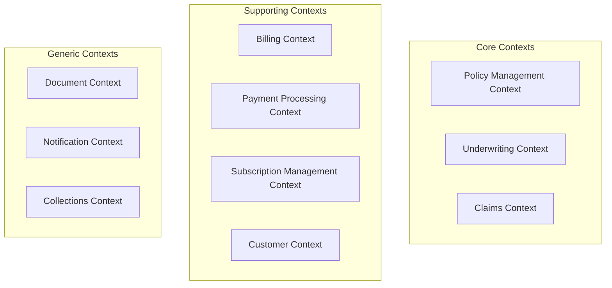
```mermaid
graph TB
    subgraph "Core Contexts"
        PM[Policy Management Context]
        UW[Underwriting Context]
        CL[Claims Context]
    end

    subgraph "Supporting Contexts"
        BP[Billing Context]
        PPC[Payment Processing Context]
        SMC[Subscription Management Context]
        CM[Customer Context]
    end

    subgraph "Generic Contexts"
        DOC[Document Context]
        NOT[Notification Context]
        COL[Collections Context]
    end
```

#### Policy Management Context
- **Owns**: Policy lifecycle from quote through cancellation
- **Manages**: Coverage structures, endorsements, policy terms
- **Source of truth for**: What is covered and policy status

#### Underwriting Context
- **Owns**: Risk assessment and evaluation
- **Manages**: Pricing rules, premium calculation logic, underwriting guidelines
- **Source of truth for**: Risk decisions and approved premiums

#### Claims Context
- **Owns**: Claims from first notice of loss through settlement
- **Manages**: Claim investigation, adjudication, reserve management
- **Source of truth for**: Claim status and payments

#### Billing Context
- **Owns**: Premium billing schedules and invoicing
- **Manages**: Payment plans, invoice generation, account balances
- **Source of truth for**: What is owed

#### Payment Processing Context
- **Owns**: Payment method management and transaction processing
- **Manages**: Cards, ACH, digital wallets, transaction lifecycle
- **Source of truth for**: Payment status

#### Subscription Management Context
- **Owns**: Modern billing models (UBI, PAYG, on-demand)
- **Manages**: Usage tracking, dynamic pricing, coverage windows
- **Source of truth for**: Usage and subscription status

#### Customer Context
- **Owns**: Customer profiles and contact information
- **Manages**: Relationships, preferences, communication history
- **Source of truth for**: Customer identity

#### Document Context
- **Owns**: Policy document generation
- **Manages**: Templates, versioning, storage
- **Provides**: Document generation services

#### Notification Context
- **Owns**: Multi-channel communications
- **Manages**: Email, SMS, mail delivery
- **Provides**: Notification services

#### Collections Context
- **Owns**: Delinquent account management
- **Manages**: Collection workflows, write-offs
- **Source of truth for**: Collection status

---

## 3. Context Map

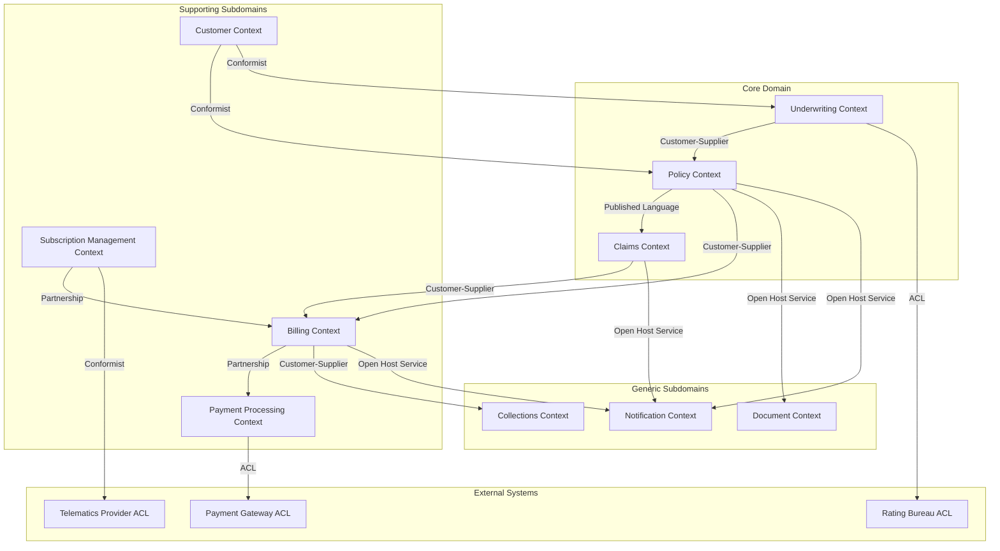
```mermaid
graph TB
    subgraph "Core Domain"
        PC[Policy Context]
        UC[Underwriting Context]
        CC[Claims Context]
    end

    subgraph "Supporting Subdomains"
        BC[Billing Context]
        PMC[Payment Processing Context]
        SMC[Subscription Management Context]
        CRM[Customer Context]
    end

    subgraph "Generic Subdomains"
        AC[Collections Context]
        NC[Notification Context]
        DC[Document Context]
    end

    subgraph "External Systems"
        PG[Payment Gateway ACL]
        TM[Telematics Provider ACL]
        RB[Rating Bureau ACL]
    end

    CRM -->|Conformist| PC
    CRM -->|Conformist| UC
    UC -->|Customer-Supplier| PC
    PC -->|Published Language| CC
    PC -->|Customer-Supplier| BC
    CC -->|Customer-Supplier| BC

    BC -->|Partnership| PMC
    BC -->|Customer-Supplier| AC
    SMC -->|Partnership| BC
    SMC -->|Conformist| TM

    PMC -->|ACL| PG
    UC -->|ACL| RB

    PC -->|Open Host Service| DC
    PC -->|Open Host Service| NC
    CC -->|Open Host Service| NC
    BC -->|Open Host Service| NC
```

### 3.1 Relationship Details

| Upstream | Downstream | Relationship | Rationale |
|----------|------------|--------------|-----------|
| Underwriting | Policy Management | Customer-Supplier | Policy dictates interface for risk evaluation |
| Policy Management | Billing | Customer-Supplier | Billing reacts to policy events |
| Policy Management | Claims | Published Language | Stable schema for policy coverage data |
| Customer | Policy Management | Conformist | Policy conforms to Customer's party model |
| Billing | Payment Processing | Partnership | Close collaboration on payment flows |
| Subscription | Billing | Partnership | Usage determines billing |
| Payment Processing | Payment Gateway | Anti-Corruption Layer | Protects from external complexity |

---

## 4. Ubiquitous Language

### 4.1 Policy Management Context

| Term | Definition |
|------|------------|
| **Quote** | A preliminary pricing estimate before formal application. Not a commitment. |
| **Application** | A formal request for coverage submitted for underwriting review. |
| **Policy** | A bound insurance contract providing coverage for specified risks. |
| **Coverage** | Protection against a specific type of loss (e.g., liability, collision). |
| **Rider/Endorsement** | A modification to standard policy terms, adding or restricting coverage. |
| **Policy Period** | The time span during which coverage is active. |
| **Effective Date** | The moment coverage begins. |
| **Expiration Date** | The moment coverage ends unless renewed. |
| **Renewal** | Continuation of coverage for a new policy period. |
| **Cancellation** | Termination of coverage before expiration. |
| **Reinstatement** | Restoration of a cancelled or lapsed policy. |
| **Insured** | The party protected by the policy. |
| **Named Insured** | The primary party named on the policy, responsible for premiums. |
| **Additional Insured** | A party added to the policy who also receives coverage. |
| **Deductible** | Amount the insured must pay before coverage applies. |
| **Limit** | Maximum amount the insurer will pay for a covered loss. |
| **Premium** | The calculated price for the policy or coverage. |

### 4.2 Underwriting Context

| Term | Definition |
|------|------------|
| **Risk** | The potential for financial loss; the subject of underwriting evaluation. |
| **Risk Factor** | A characteristic that influences the likelihood or severity of loss. |
| **Risk Score** | Quantified assessment of risk level based on factors. |
| **Underwriting Decision** | Approve, decline, or refer with conditions. |
| **Binding Authority** | The limit of risk an underwriter can accept without referral. |
| **Referral** | Escalation to higher authority when risk exceeds guidelines. |
| **Rating** | The process of calculating premium based on risk characteristics. |
| **Rate** | Price per unit of exposure. |
| **Loading** | Adjustment to base rate for specific risk characteristics. |
| **Discount** | Reduction in premium for favorable characteristics. |

### 4.3 Claims Context

| Term | Definition |
|------|------------|
| **Claim** | A formal request for payment under policy coverage. |
| **First Notice of Loss (FNOL)** | Initial report of a potential claim. |
| **Claimant** | The party making the claim. |
| **Loss** | The damage or injury that triggered the claim. |
| **Occurrence** | The event or accident causing the loss. |
| **Reserve** | Estimated amount set aside to pay the claim. |
| **Adjuster** | Person who investigates and evaluates claims. |
| **Adjudication** | The process of determining claim validity and amount. |
| **Settlement** | Resolution of the claim with payment or denial. |
| **Subrogation** | Insurer's right to recover payment from responsible third party. |

### 4.4 Billing Context

| Term | Definition |
|------|------------|
| **Billing Account** | The financial account tracking a customer's billing relationship. |
| **Invoice** | A request for payment for a specific amount due. |
| **Payment Plan** | Arrangement defining how and when premiums are collected. |
| **Installment** | A single scheduled payment within a payment plan. |
| **Grace Period** | Time after due date before coverage is affected. |
| **Pro-Rata Adjustment** | Proportional premium change for mid-term coverage changes. |

---

## 5. Customer Journeys

### 5.1 Policy Acquisition Journey

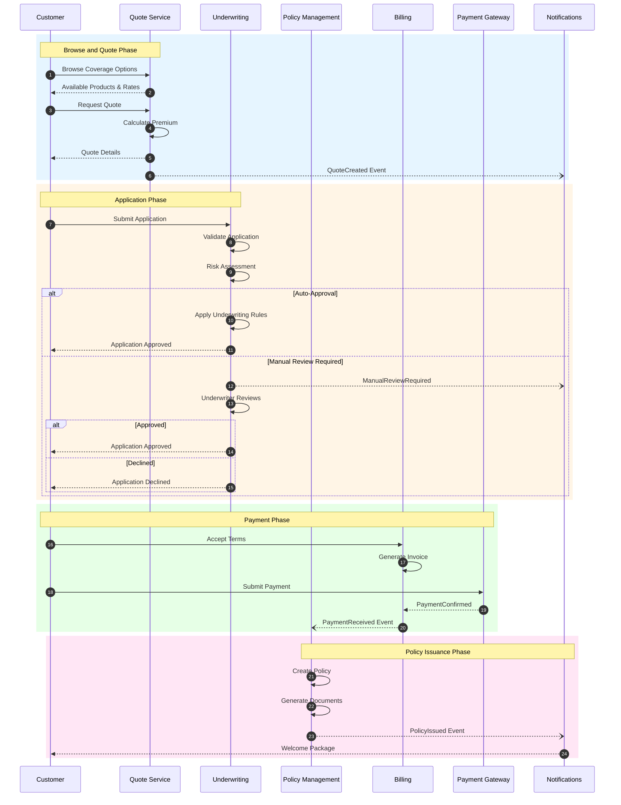
```mermaid
sequenceDiagram
    autonumber
    participant C as Customer
    participant QS as Quote Service
    participant UW as Underwriting
    participant PM as Policy Management
    participant BL as Billing
    participant PAY as Payment Gateway
    participant NOT as Notifications

    rect rgb(230, 245, 255)
        Note over C,QS: Browse and Quote Phase
        C->>QS: Browse Coverage Options
        QS-->>C: Available Products & Rates
        C->>QS: Request Quote
        QS->>QS: Calculate Premium
        QS-->>C: Quote Details
        QS--)NOT: QuoteCreated Event
    end

    rect rgb(255, 245, 230)
        Note over C,UW: Application Phase
        C->>UW: Submit Application
        UW->>UW: Validate Application
        UW->>UW: Risk Assessment
        alt Auto-Approval
            UW->>UW: Apply Underwriting Rules
            UW-->>C: Application Approved
        else Manual Review Required
            UW--)NOT: ManualReviewRequired
            UW->>UW: Underwriter Reviews
            alt Approved
                UW-->>C: Application Approved
            else Declined
                UW-->>C: Application Declined
            end
        end
    end

    rect rgb(230, 255, 230)
        Note over C,PAY: Payment Phase
        C->>BL: Accept Terms
        BL->>BL: Generate Invoice
        C->>PAY: Submit Payment
        PAY-->>BL: PaymentConfirmed
        BL--)PM: PaymentReceived Event
    end

    rect rgb(255, 230, 245)
        Note over PM,NOT: Policy Issuance Phase
        PM->>PM: Create Policy
        PM->>PM: Generate Documents
        PM--)NOT: PolicyIssued Event
        NOT-->>C: Welcome Package
    end
```

### 5.2 Policy Management Journey

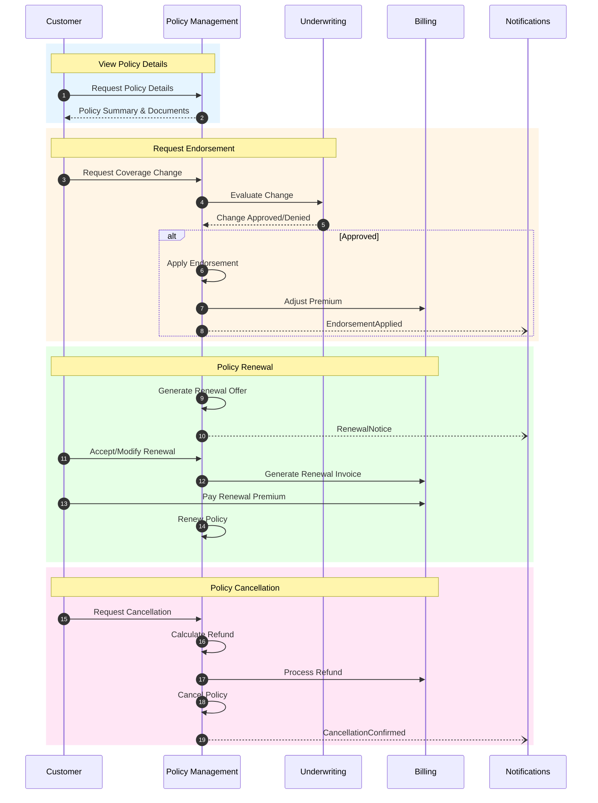
```mermaid
sequenceDiagram
    autonumber
    participant C as Customer
    participant PM as Policy Management
    participant UW as Underwriting
    participant BL as Billing
    participant NOT as Notifications

    rect rgb(230, 245, 255)
        Note over C,PM: View Policy Details
        C->>PM: Request Policy Details
        PM-->>C: Policy Summary & Documents
    end

    rect rgb(255, 245, 230)
        Note over C,UW: Request Endorsement
        C->>PM: Request Coverage Change
        PM->>UW: Evaluate Change
        UW-->>PM: Change Approved/Denied
        alt Approved
            PM->>PM: Apply Endorsement
            PM->>BL: Adjust Premium
            PM--)NOT: EndorsementApplied
        end
    end

    rect rgb(230, 255, 230)
        Note over C,BL: Policy Renewal
        PM->>PM: Generate Renewal Offer
        PM--)NOT: RenewalNotice
        C->>PM: Accept/Modify Renewal
        PM->>BL: Generate Renewal Invoice
        C->>BL: Pay Renewal Premium
        PM->>PM: Renew Policy
    end

    rect rgb(255, 230, 245)
        Note over C,BL: Policy Cancellation
        C->>PM: Request Cancellation
        PM->>PM: Calculate Refund
        PM->>BL: Process Refund
        PM->>PM: Cancel Policy
        PM--)NOT: CancellationConfirmed
    end
```

### 5.3 Claims Journey

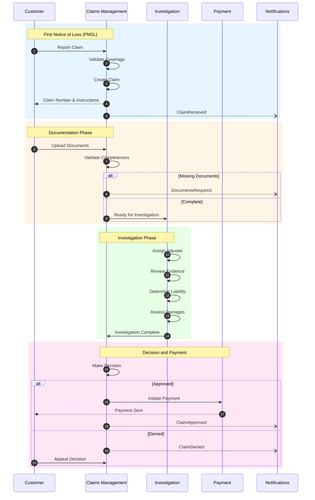
```mermaid
sequenceDiagram
    autonumber
    participant C as Customer
    participant CM as Claims Management
    participant INV as Investigation
    participant PAY as Payment
    participant NOT as Notifications

    rect rgb(230, 245, 255)
        Note over C,CM: First Notice of Loss (FNOL)
        C->>CM: Report Claim
        CM->>CM: Validate Coverage
        CM->>CM: Create Claim
        CM-->>C: Claim Number & Instructions
        CM--)NOT: ClaimReceived
    end

    rect rgb(255, 245, 230)
        Note over C,CM: Documentation Phase
        C->>CM: Upload Documents
        CM->>CM: Validate Completeness
        alt Missing Documents
            CM--)NOT: DocumentsRequired
        else Complete
            CM->>INV: Ready for Investigation
        end
    end

    rect rgb(230, 255, 230)
        Note over INV,CM: Investigation Phase
        INV->>INV: Assign Adjuster
        INV->>INV: Review Evidence
        INV->>INV: Determine Liability
        INV->>INV: Assess Damages
        INV->>CM: Investigation Complete
    end

    rect rgb(255, 230, 245)
        Note over CM,PAY: Decision and Payment
        CM->>CM: Make Decision
        alt Approved
            CM->>PAY: Initiate Payment
            PAY-->>C: Payment Sent
            CM--)NOT: ClaimApproved
        else Denied
            CM--)NOT: ClaimDenied
            C->>CM: Appeal Decision
        end
    end
```

### 5.4 Billing Journey

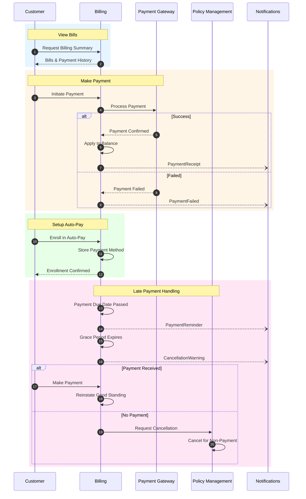
```mermaid
sequenceDiagram
    autonumber
    participant C as Customer
    participant BL as Billing
    participant PAY as Payment Gateway
    participant PM as Policy Management
    participant NOT as Notifications

    rect rgb(230, 245, 255)
        Note over C,BL: View Bills
        C->>BL: Request Billing Summary
        BL-->>C: Bills & Payment History
    end

    rect rgb(255, 245, 230)
        Note over C,PAY: Make Payment
        C->>BL: Initiate Payment
        BL->>PAY: Process Payment
        alt Success
            PAY-->>BL: Payment Confirmed
            BL->>BL: Apply to Balance
            BL--)NOT: PaymentReceipt
        else Failed
            PAY-->>BL: Payment Failed
            BL--)NOT: PaymentFailed
        end
    end

    rect rgb(230, 255, 230)
        Note over C,BL: Setup Auto-Pay
        C->>BL: Enroll in Auto-Pay
        BL->>BL: Store Payment Method
        BL-->>C: Enrollment Confirmed
    end

    rect rgb(255, 230, 245)
        Note over BL,PM: Late Payment Handling
        BL->>BL: Payment Due Date Passed
        BL--)NOT: PaymentReminder
        BL->>BL: Grace Period Expires
        BL--)NOT: CancellationWarning
        alt Payment Received
            C->>BL: Make Payment
            BL->>BL: Reinstate Good Standing
        else No Payment
            BL->>PM: Request Cancellation
            PM->>PM: Cancel for Non-Payment
        end
    end
```

---

## 6. Tactical Design - Aggregates

### 6.1 Policy Aggregate

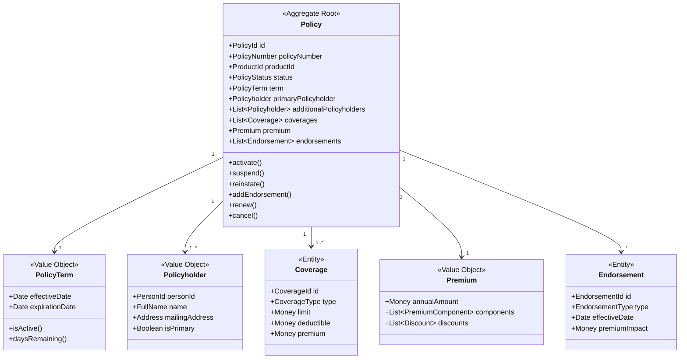
```mermaid
classDiagram
    class Policy {
        <<Aggregate Root>>
        +PolicyId id
        +PolicyNumber policyNumber
        +ProductId productId
        +PolicyStatus status
        +PolicyTerm term
        +Policyholder primaryPolicyholder
        +List~Policyholder~ additionalPolicyholders
        +List~Coverage~ coverages
        +Premium premium
        +List~Endorsement~ endorsements
        +activate()
        +suspend()
        +reinstate()
        +addEndorsement()
        +renew()
        +cancel()
    }

    class PolicyTerm {
        <<Value Object>>
        +Date effectiveDate
        +Date expirationDate
        +isActive()
        +daysRemaining()
    }

    class Policyholder {
        <<Value Object>>
        +PersonId personId
        +FullName name
        +Address mailingAddress
        +Boolean isPrimary
    }

    class Coverage {
        <<Entity>>
        +CoverageId id
        +CoverageType type
        +Money limit
        +Money deductible
        +Money premium
    }

    class Premium {
        <<Value Object>>
        +Money annualAmount
        +List~PremiumComponent~ components
        +List~Discount~ discounts
    }

    class Endorsement {
        <<Entity>>
        +EndorsementId id
        +EndorsementType type
        +Date effectiveDate
        +Money premiumImpact
    }

    Policy "1" --> "1" PolicyTerm
    Policy "1" --> "1..*" Policyholder
    Policy "1" --> "1..*" Coverage
    Policy "1" --> "1" Premium
    Policy "1" --> "*" Endorsement
```

### 6.2 Quote Aggregate

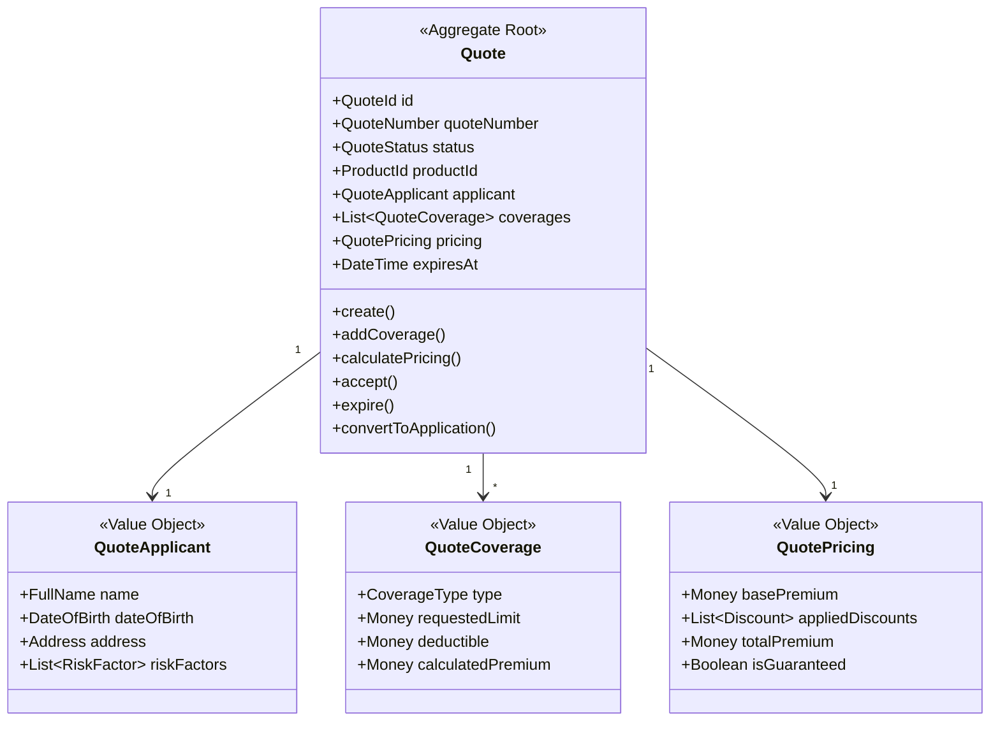
```mermaid
classDiagram
    class Quote {
        <<Aggregate Root>>
        +QuoteId id
        +QuoteNumber quoteNumber
        +QuoteStatus status
        +ProductId productId
        +QuoteApplicant applicant
        +List~QuoteCoverage~ coverages
        +QuotePricing pricing
        +DateTime expiresAt
        +create()
        +addCoverage()
        +calculatePricing()
        +accept()
        +expire()
        +convertToApplication()
    }

    class QuoteApplicant {
        <<Value Object>>
        +FullName name
        +DateOfBirth dateOfBirth
        +Address address
        +List~RiskFactor~ riskFactors
    }

    class QuoteCoverage {
        <<Value Object>>
        +CoverageType type
        +Money requestedLimit
        +Money deductible
        +Money calculatedPremium
    }

    class QuotePricing {
        <<Value Object>>
        +Money basePremium
        +List~Discount~ appliedDiscounts
        +Money totalPremium
        +Boolean isGuaranteed
    }

    Quote "1" --> "1" QuoteApplicant
    Quote "1" --> "*" QuoteCoverage
    Quote "1" --> "1" QuotePricing
```

### 6.3 Application Aggregate

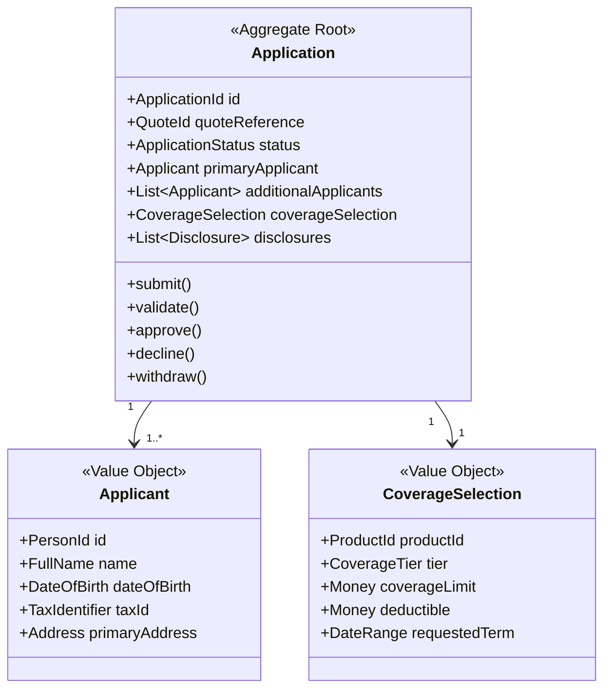
```mermaid
classDiagram
    class Application {
        <<Aggregate Root>>
        +ApplicationId id
        +QuoteId quoteReference
        +ApplicationStatus status
        +Applicant primaryApplicant
        +List~Applicant~ additionalApplicants
        +CoverageSelection coverageSelection
        +List~Disclosure~ disclosures
        +submit()
        +validate()
        +approve()
        +decline()
        +withdraw()
    }

    class Applicant {
        <<Value Object>>
        +PersonId id
        +FullName name
        +DateOfBirth dateOfBirth
        +TaxIdentifier taxId
        +Address primaryAddress
    }

    class CoverageSelection {
        <<Value Object>>
        +ProductId productId
        +CoverageTier tier
        +Money coverageLimit
        +Money deductible
        +DateRange requestedTerm
    }

    Application "1" --> "1..*" Applicant
    Application "1" --> "1" CoverageSelection
```

### 6.4 UnderwritingCase Aggregate

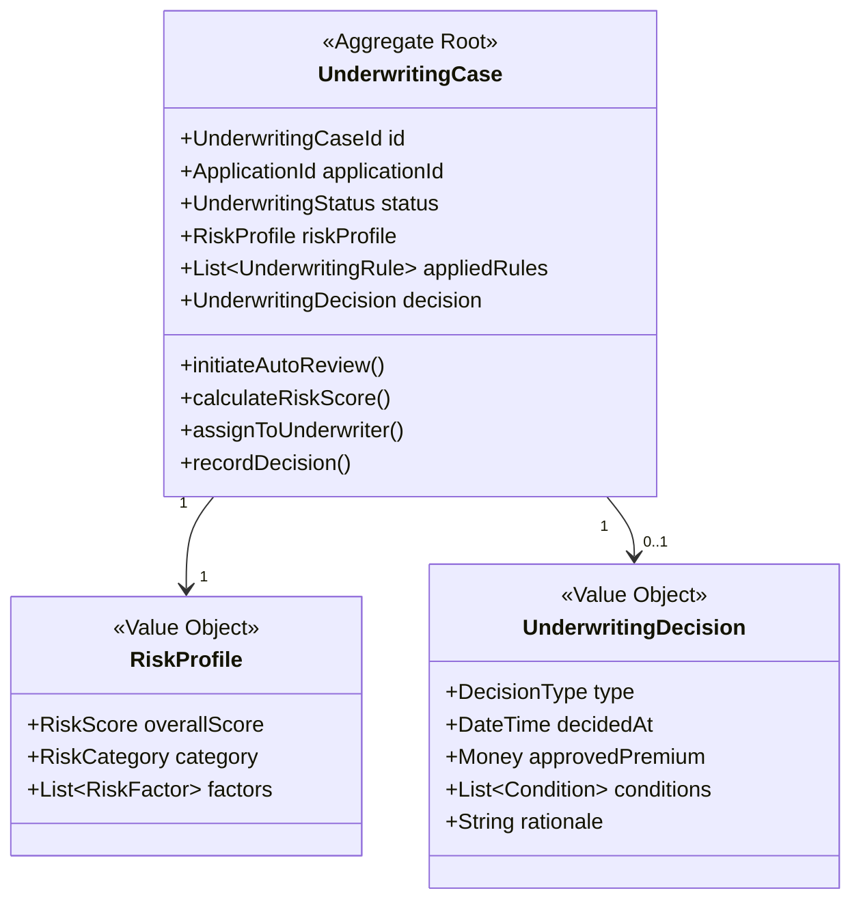
```mermaid
classDiagram
    class UnderwritingCase {
        <<Aggregate Root>>
        +UnderwritingCaseId id
        +ApplicationId applicationId
        +UnderwritingStatus status
        +RiskProfile riskProfile
        +List~UnderwritingRule~ appliedRules
        +UnderwritingDecision decision
        +initiateAutoReview()
        +calculateRiskScore()
        +assignToUnderwriter()
        +recordDecision()
    }

    class RiskProfile {
        <<Value Object>>
        +RiskScore overallScore
        +RiskCategory category
        +List~RiskFactor~ factors
    }

    class UnderwritingDecision {
        <<Value Object>>
        +DecisionType type
        +DateTime decidedAt
        +Money approvedPremium
        +List~Condition~ conditions
        +String rationale
    }

    UnderwritingCase "1" --> "1" RiskProfile
    UnderwritingCase "1" --> "0..1" UnderwritingDecision
```

### 6.5 Claim Aggregate

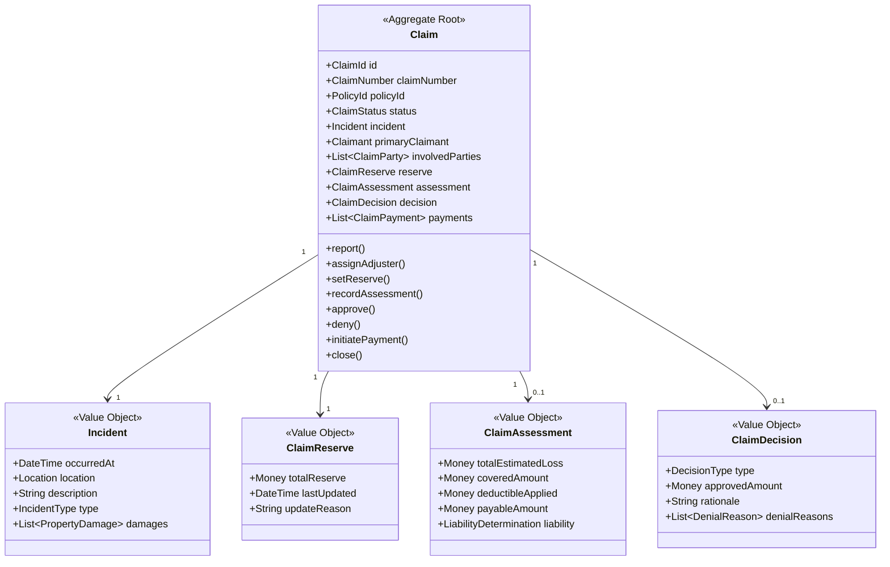
```mermaid
classDiagram
    class Claim {
        <<Aggregate Root>>
        +ClaimId id
        +ClaimNumber claimNumber
        +PolicyId policyId
        +ClaimStatus status
        +Incident incident
        +Claimant primaryClaimant
        +List~ClaimParty~ involvedParties
        +ClaimReserve reserve
        +ClaimAssessment assessment
        +ClaimDecision decision
        +List~ClaimPayment~ payments
        +report()
        +assignAdjuster()
        +setReserve()
        +recordAssessment()
        +approve()
        +deny()
        +initiatePayment()
        +close()
    }

    class Incident {
        <<Value Object>>
        +DateTime occurredAt
        +Location location
        +String description
        +IncidentType type
        +List~PropertyDamage~ damages
    }

    class ClaimReserve {
        <<Value Object>>
        +Money totalReserve
        +DateTime lastUpdated
        +String updateReason
    }

    class ClaimAssessment {
        <<Value Object>>
        +Money totalEstimatedLoss
        +Money coveredAmount
        +Money deductibleApplied
        +Money payableAmount
        +LiabilityDetermination liability
    }

    class ClaimDecision {
        <<Value Object>>
        +DecisionType type
        +Money approvedAmount
        +String rationale
        +List~DenialReason~ denialReasons
    }

    Claim "1" --> "1" Incident
    Claim "1" --> "1" ClaimReserve
    Claim "1" --> "0..1" ClaimAssessment
    Claim "1" --> "0..1" ClaimDecision
```

### 6.6 BillingAccount Aggregate

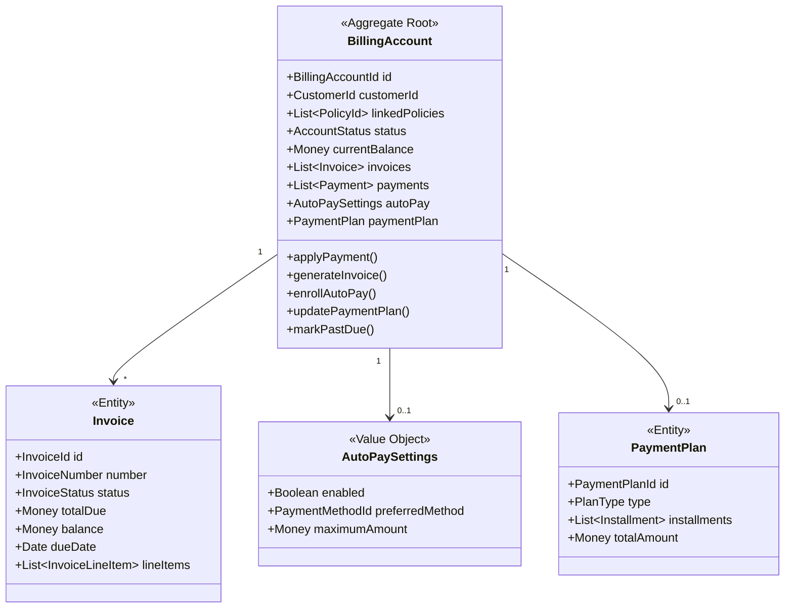
```mermaid
classDiagram
    class BillingAccount {
        <<Aggregate Root>>
        +BillingAccountId id
        +CustomerId customerId
        +List~PolicyId~ linkedPolicies
        +AccountStatus status
        +Money currentBalance
        +List~Invoice~ invoices
        +List~Payment~ payments
        +AutoPaySettings autoPay
        +PaymentPlan paymentPlan
        +applyPayment()
        +generateInvoice()
        +enrollAutoPay()
        +updatePaymentPlan()
        +markPastDue()
    }

    class Invoice {
        <<Entity>>
        +InvoiceId id
        +InvoiceNumber number
        +InvoiceStatus status
        +Money totalDue
        +Money balance
        +Date dueDate
        +List~InvoiceLineItem~ lineItems
    }

    class AutoPaySettings {
        <<Value Object>>
        +Boolean enabled
        +PaymentMethodId preferredMethod
        +Money maximumAmount
    }

    class PaymentPlan {
        <<Entity>>
        +PaymentPlanId id
        +PlanType type
        +List~Installment~ installments
        +Money totalAmount
    }

    BillingAccount "1" --> "*" Invoice
    BillingAccount "1" --> "0..1" AutoPaySettings
    BillingAccount "1" --> "0..1" PaymentPlan
```

### 6.7 PaymentMethod Aggregate

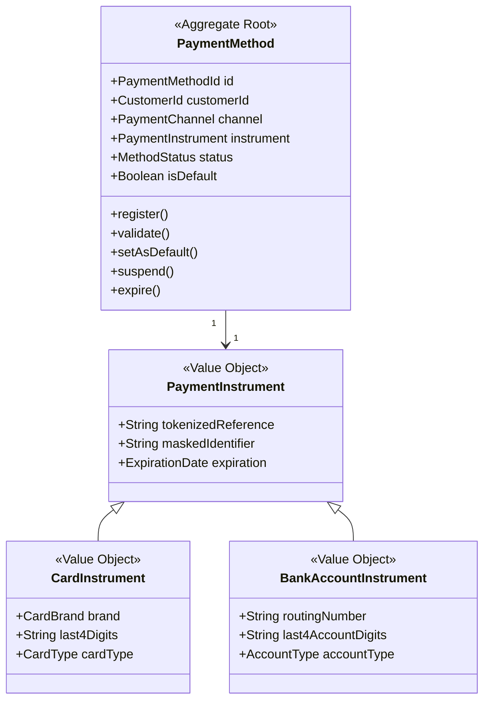
```mermaid
classDiagram
    class PaymentMethod {
        <<Aggregate Root>>
        +PaymentMethodId id
        +CustomerId customerId
        +PaymentChannel channel
        +PaymentInstrument instrument
        +MethodStatus status
        +Boolean isDefault
        +register()
        +validate()
        +setAsDefault()
        +suspend()
        +expire()
    }

    class PaymentInstrument {
        <<Value Object>>
        +String tokenizedReference
        +String maskedIdentifier
        +ExpirationDate expiration
    }

    class CardInstrument {
        <<Value Object>>
        +CardBrand brand
        +String last4Digits
        +CardType cardType
    }

    class BankAccountInstrument {
        <<Value Object>>
        +String routingNumber
        +String last4AccountDigits
        +AccountType accountType
    }

    PaymentMethod "1" --> "1" PaymentInstrument
    PaymentInstrument <|-- CardInstrument
    PaymentInstrument <|-- BankAccountInstrument
```

### 6.8 Subscription Aggregate

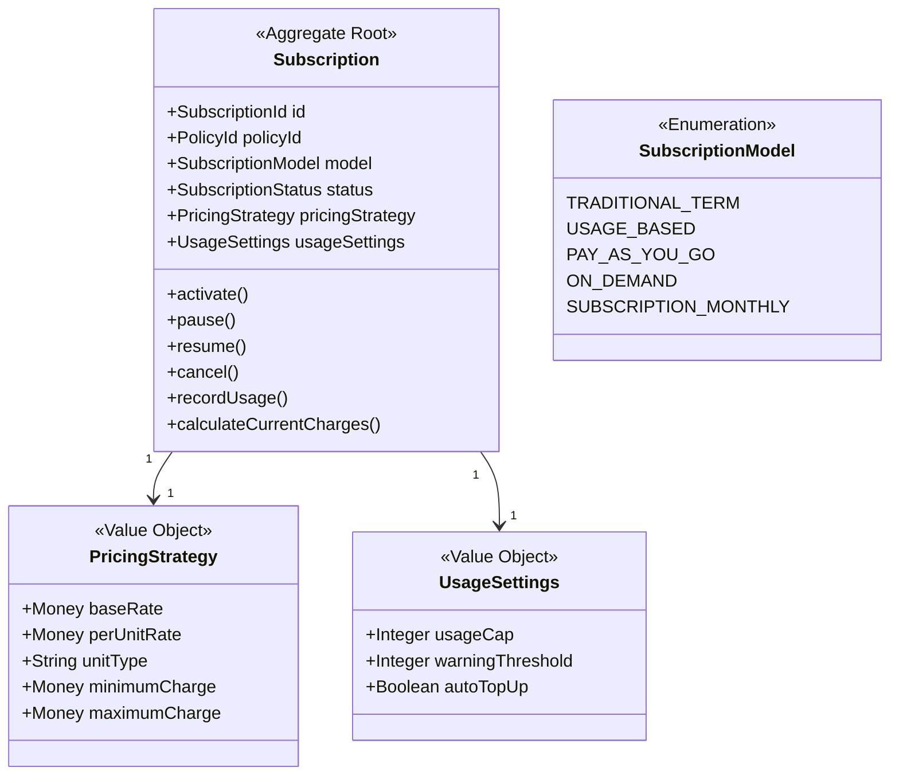
```mermaid
classDiagram
    class Subscription {
        <<Aggregate Root>>
        +SubscriptionId id
        +PolicyId policyId
        +SubscriptionModel model
        +SubscriptionStatus status
        +PricingStrategy pricingStrategy
        +UsageSettings usageSettings
        +activate()
        +pause()
        +resume()
        +cancel()
        +recordUsage()
        +calculateCurrentCharges()
    }

    class PricingStrategy {
        <<Value Object>>
        +Money baseRate
        +Money perUnitRate
        +String unitType
        +Money minimumCharge
        +Money maximumCharge
    }

    class UsageSettings {
        <<Value Object>>
        +Integer usageCap
        +Integer warningThreshold
        +Boolean autoTopUp
    }

    class SubscriptionModel {
        <<Enumeration>>
        TRADITIONAL_TERM
        USAGE_BASED
        PAY_AS_YOU_GO
        ON_DEMAND
        SUBSCRIPTION_MONTHLY
    }

    Subscription "1" --> "1" PricingStrategy
    Subscription "1" --> "1" UsageSettings
```

---

## 7. State Machines

### 7.1 Quote Lifecycle

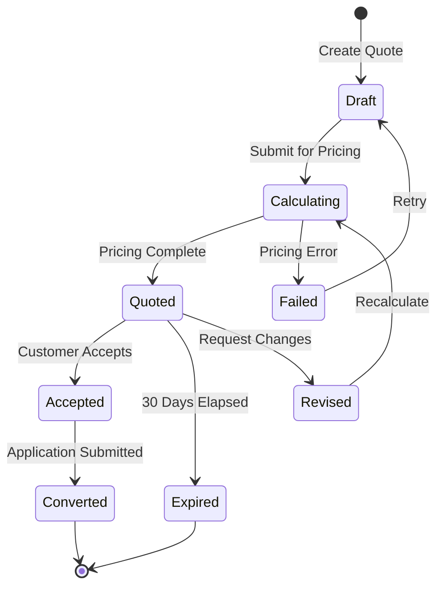
```mermaid
stateDiagram-v2
    [*] --> Draft: Create Quote
    Draft --> Calculating: Submit for Pricing
    Calculating --> Quoted: Pricing Complete
    Calculating --> Failed: Pricing Error
    Failed --> Draft: Retry
    Quoted --> Accepted: Customer Accepts
    Quoted --> Expired: 30 Days Elapsed
    Quoted --> Revised: Request Changes
    Revised --> Calculating: Recalculate
    Accepted --> Converted: Application Submitted
    Expired --> [*]
    Converted --> [*]
```

### 7.2 Application Lifecycle

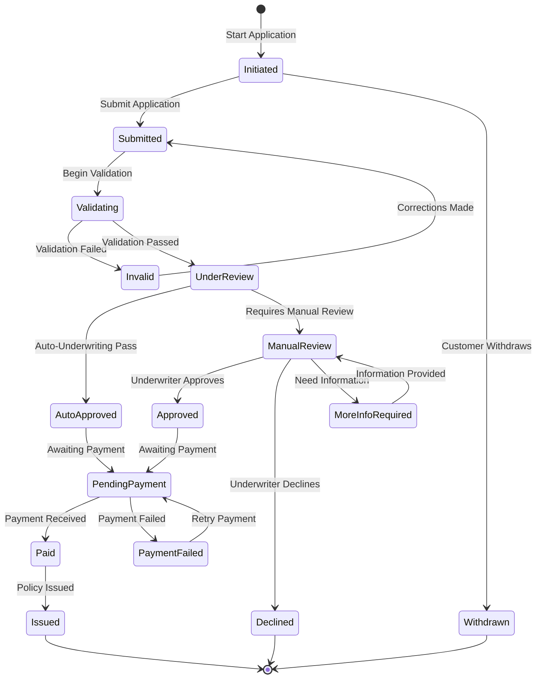
```mermaid
stateDiagram-v2
    [*] --> Initiated: Start Application
    Initiated --> Submitted: Submit Application
    Submitted --> Validating: Begin Validation
    Validating --> Invalid: Validation Failed
    Invalid --> Submitted: Corrections Made
    Validating --> UnderReview: Validation Passed
    UnderReview --> AutoApproved: Auto-Underwriting Pass
    UnderReview --> ManualReview: Requires Manual Review
    ManualReview --> Approved: Underwriter Approves
    ManualReview --> Declined: Underwriter Declines
    ManualReview --> MoreInfoRequired: Need Information
    MoreInfoRequired --> ManualReview: Information Provided
    AutoApproved --> PendingPayment: Awaiting Payment
    Approved --> PendingPayment: Awaiting Payment
    PendingPayment --> Paid: Payment Received
    PendingPayment --> PaymentFailed: Payment Failed
    PaymentFailed --> PendingPayment: Retry Payment
    Paid --> Issued: Policy Issued
    Declined --> [*]
    Issued --> [*]
    Initiated --> Withdrawn: Customer Withdraws
    Withdrawn --> [*]
```

### 7.3 Policy Lifecycle

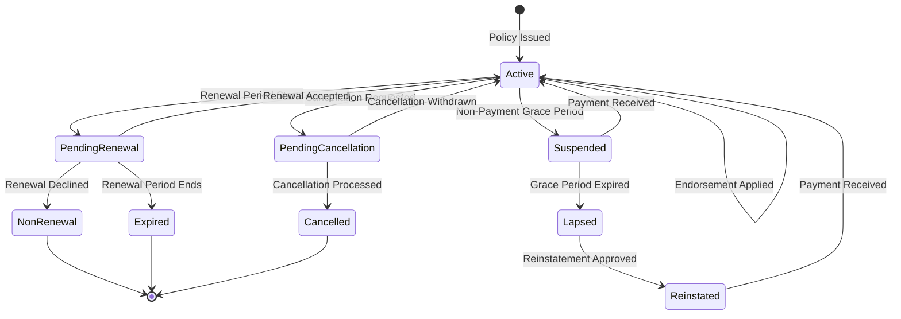
```mermaid
stateDiagram-v2
    [*] --> Active: Policy Issued
    Active --> Active: Endorsement Applied
    Active --> PendingRenewal: Renewal Period Starts
    Active --> PendingCancellation: Cancellation Requested
    Active --> Suspended: Non-Payment Grace Period

    PendingRenewal --> Active: Renewal Accepted
    PendingRenewal --> NonRenewal: Renewal Declined
    PendingRenewal --> Expired: Renewal Period Ends

    Suspended --> Active: Payment Received
    Suspended --> Lapsed: Grace Period Expired

    PendingCancellation --> Cancelled: Cancellation Processed
    PendingCancellation --> Active: Cancellation Withdrawn

    Lapsed --> Reinstated: Reinstatement Approved
    Reinstated --> Active: Payment Received

    NonRenewal --> [*]
    Expired --> [*]
    Cancelled --> [*]
```

### 7.4 Claim Lifecycle

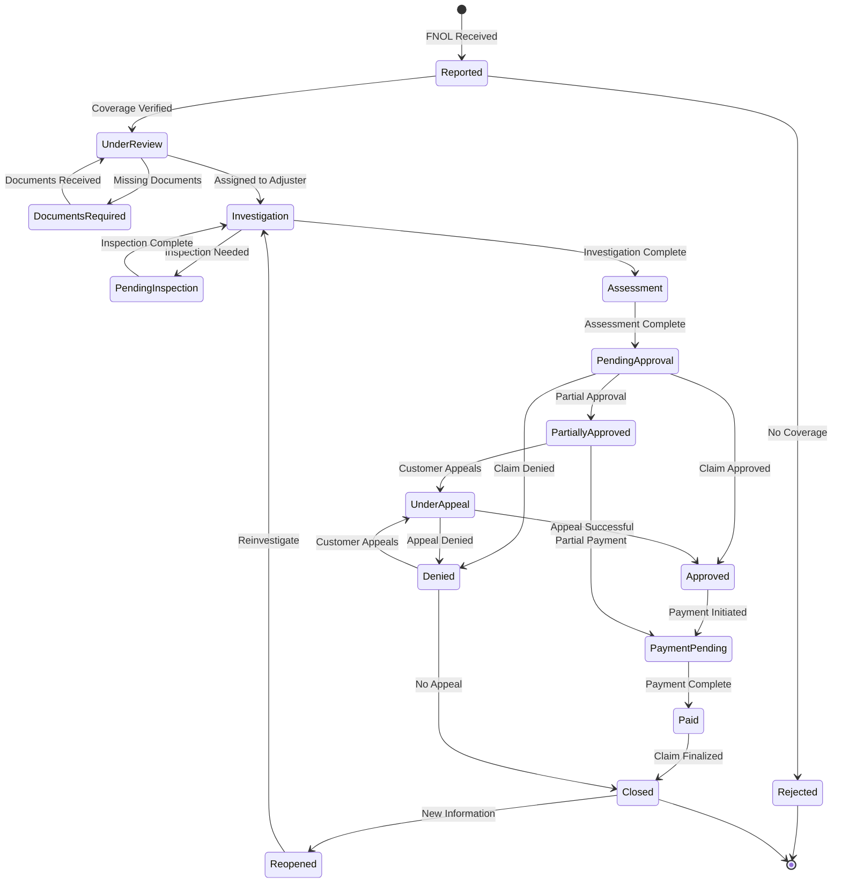
```mermaid
stateDiagram-v2
    [*] --> Reported: FNOL Received
    Reported --> UnderReview: Coverage Verified
    Reported --> Rejected: No Coverage

    UnderReview --> DocumentsRequired: Missing Documents
    DocumentsRequired --> UnderReview: Documents Received
    UnderReview --> Investigation: Assigned to Adjuster

    Investigation --> PendingInspection: Inspection Needed
    PendingInspection --> Investigation: Inspection Complete
    Investigation --> Assessment: Investigation Complete

    Assessment --> PendingApproval: Assessment Complete
    PendingApproval --> Approved: Claim Approved
    PendingApproval --> PartiallyApproved: Partial Approval
    PendingApproval --> Denied: Claim Denied

    Approved --> PaymentPending: Payment Initiated
    PartiallyApproved --> PaymentPending: Partial Payment
    PartiallyApproved --> UnderAppeal: Customer Appeals
    Denied --> UnderAppeal: Customer Appeals

    UnderAppeal --> Approved: Appeal Successful
    UnderAppeal --> Denied: Appeal Denied

    PaymentPending --> Paid: Payment Complete
    Paid --> Closed: Claim Finalized
    Denied --> Closed: No Appeal

    Closed --> Reopened: New Information
    Reopened --> Investigation: Reinvestigate

    Rejected --> [*]
    Closed --> [*]
```

### 7.5 Payment Transaction Lifecycle

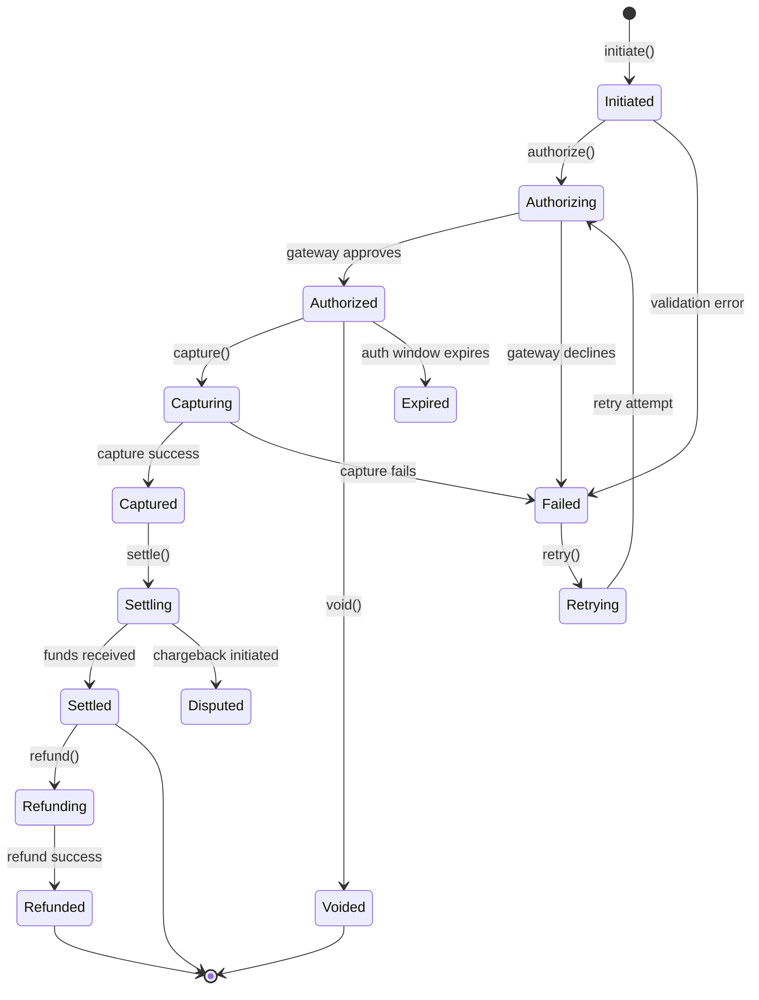
```mermaid
stateDiagram-v2
    [*] --> Initiated: initiate()

    Initiated --> Authorizing: authorize()
    Initiated --> Failed: validation error

    Authorizing --> Authorized: gateway approves
    Authorizing --> Failed: gateway declines

    Authorized --> Capturing: capture()
    Authorized --> Voided: void()
    Authorized --> Expired: auth window expires

    Capturing --> Captured: capture success
    Capturing --> Failed: capture fails

    Captured --> Settling: settle()

    Settling --> Settled: funds received
    Settling --> Disputed: chargeback initiated

    Settled --> Refunding: refund()

    Refunding --> Refunded: refund success

    Failed --> Retrying: retry()
    Retrying --> Authorizing: retry attempt

    Voided --> [*]
    Settled --> [*]
    Refunded --> [*]
```

### 7.6 Billing Account Lifecycle

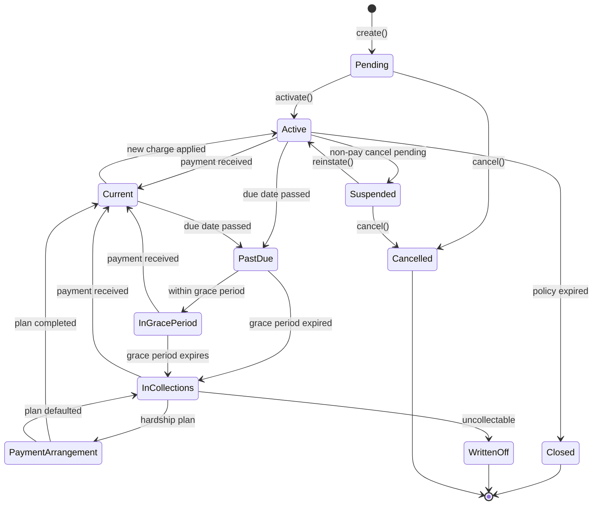
```mermaid
stateDiagram-v2
    [*] --> Pending: create()

    Pending --> Active: activate()
    Pending --> Cancelled: cancel()

    Active --> Current: payment received
    Active --> PastDue: due date passed
    Active --> Suspended: non-pay cancel pending

    Current --> PastDue: due date passed
    Current --> Active: new charge applied

    PastDue --> InGracePeriod: within grace period
    PastDue --> InCollections: grace period expired

    InGracePeriod --> Current: payment received
    InGracePeriod --> InCollections: grace period expires

    InCollections --> Current: payment received
    InCollections --> PaymentArrangement: hardship plan
    InCollections --> WrittenOff: uncollectable

    PaymentArrangement --> Current: plan completed
    PaymentArrangement --> InCollections: plan defaulted

    Suspended --> Active: reinstate()
    Suspended --> Cancelled: cancel()

    Active --> Closed: policy expired

    Closed --> [*]
    WrittenOff --> [*]
    Cancelled --> [*]
```

---

## 8. Business Rules and Invariants

### 8.1 Quote Rules
- BR-QT-1: Quote valid for 30 days from creation
- BR-QT-2: Customer must meet minimum eligibility criteria
- BR-QT-3: Coverage limits must be within product boundaries
- BR-QT-4: Effective date must be within 60 days of quote date

### 8.2 Policy Rules
- BR-PL-1: Policy must have exactly one primary insured
- BR-PL-2: Coverage limits cannot be negative
- BR-PL-3: Effective date must be before expiration date
- BR-PL-4: Premium must be greater than zero
- BR-PL-5: At least one coverage must be selected

### 8.3 Underwriting Rules
- BR-UW-1: Auto-approval only for risk scores below threshold
- BR-UW-2: Manual review required for risk scores above threshold
- BR-UW-3: Decline automatically for excluded risk factors
- BR-UW-4: Premium adjustments cannot exceed 50% of base rate

### 8.4 Claim Rules
- BR-CL-1: Claim amount cannot exceed policy limits
- BR-CL-2: Claim must reference valid policy
- BR-CL-3: Reserve amount must be set within 24 hours
- BR-CL-4: Payment total cannot exceed approved amount
- BR-CL-5: Deductible must be applied before payment

### 8.5 Billing Rules
- BR-BL-1: Invoices must be issued at least 14 days before due date
- BR-BL-2: Late fees applied after 10-day grace period
- BR-BL-3: Maximum late fee is lesser of 5% or $25
- BR-BL-4: Payments allocated to oldest invoices first

### 8.6 Payment Plan Rules
- BR-PP-1: Standard plans require 10% down payment
- BR-PP-2: Flexible date plans allow selection of 1st-28th
- BR-PP-3: Three consecutive missed installments trigger default
- BR-PP-4: Hardship plans require income verification

### 8.7 Cancellation Rules
- BR-CN-1: Pro-rata refund for customer-initiated cancellation
- BR-CN-2: Short-rate refund for cancellation within first 60 days
- BR-CN-3: No refund for cancellation due to fraud
- BR-CN-4: Minimum earned premium of 25% applies
- BR-CN-5: Active claims must be resolved before cancellation

---

## 9. Domain Events

### 9.1 Policy Context Events

| Event | Trigger | Consumers |
|-------|---------|-----------|
| `QuoteCreated` | New quote generated | Notification |
| `QuoteExpired` | Validity period ended | Notification |
| `ApplicationSubmitted` | Application sent for review | Underwriting |
| `PolicyIssued` | Policy created and bound | Billing, Documents, Notification |
| `CoverageAdded` | New coverage added | Billing, Documents |
| `EndorsementApplied` | Policy modified | Billing, Documents |
| `PolicyRenewed` | Policy renewed for new term | Billing, Documents, Notification |
| `PolicyCancelled` | Policy terminated | Billing, Documents, Notification, Claims |
| `PolicyReinstated` | Cancelled policy restored | Billing, Notification |

### 9.2 Underwriting Context Events

| Event | Trigger | Consumers |
|-------|---------|-----------|
| `UnderwritingCaseCreated` | Application received | - |
| `RiskAssessmentCompleted` | Evaluation finished | - |
| `UnderwritingDecisionMade` | Decision rendered | Policy Management |
| `CaseReferredToSenior` | Exceeds authority | - |

### 9.3 Claims Context Events

| Event | Trigger | Consumers |
|-------|---------|-----------|
| `ClaimReported` | FNOL received | Notification |
| `ClaimAssigned` | Adjuster assigned | - |
| `ReserveSet` | Initial reserve established | Finance |
| `ClaimApproved` | Claim approved for payment | Billing, Notification |
| `ClaimDenied` | Claim denied | Notification |
| `PaymentIssued` | Payment made | Billing |
| `ClaimClosed` | Claim finalized | Analytics |

### 9.4 Billing Context Events

| Event | Trigger | Consumers |
|-------|---------|-----------|
| `BillingAccountCreated` | Policy bound | - |
| `InvoiceGenerated` | Premium due | Notification |
| `PaymentReceived` | Customer paid | Notification |
| `PaymentPastDue` | Due date passed | Notification, Policy |
| `AccountDelinquent` | Significantly overdue | Policy |
| `RefundIssued` | Overpayment/cancellation | Notification |

### 9.5 Subscription Context Events

| Event | Trigger | Consumers |
|-------|---------|-----------|
| `SubscriptionActivated` | Coverage begins | Billing |
| `UsageRecorded` | New usage entry | Billing |
| `UsagePeriodFinalized` | Period closed | Billing |
| `CoverageWindowActivated` | On-demand starts | Billing |
| `RiskScoreUpdated` | Behavior score changed | Underwriting |

---

## 10. Read Models (CQRS)

### 10.1 PolicySummaryView

```
PolicySummaryView {
    policyId: string
    policyNumber: string
    productName: string
    status: PolicyStatus
    effectiveDate: Date
    expirationDate: Date
    primaryInsured: { name, email }
    coverageSummary: [{ type, limit, deductible }]
    nextPaymentDue: { amount, dueDate }
    documentsAvailable: number
    openClaimsCount: number
}
```

### 10.2 ClaimStatusView

```
ClaimStatusView {
    claimId: string
    claimNumber: string
    policyNumber: string
    status: ClaimStatus
    reportedDate: Date
    incidentDate: Date
    assignedAdjuster: { name, phone, email }
    timeline: [{ date, event, description }]
    amountClaimed: Money
    amountApproved: Money
    amountPaid: Money
    nextAction: string
}
```

### 10.3 BillingDashboardView

```
BillingDashboardView {
    accountId: string
    accountStatus: AccountStatus
    currentBalance: Money
    pastDueAmount: Money
    nextPaymentDue: { amount, dueDate }
    autoPayStatus: { enrolled, paymentMethod, nextDate }
    recentTransactions: [{ date, type, amount, status }]
    upcomingBills: [{ invoiceNumber, amount, dueDate }]
}
```

### 10.4 UnderwritingQueueView

```
UnderwritingQueueView {
    queueSummary: { pendingCount, avgAgeHours }
    items: [{
        applicationId: string
        applicantName: string
        productType: string
        riskScore: number
        riskCategory: RiskCategory
        receivedAt: DateTime
        priority: Priority
    }]
}
```

---

## 11. Sagas and Process Managers

### 11.1 New Policy Issuance Saga

```mermaid
stateDiagram-v2
    [*] --> AwaitingApplication: ApplicationSubmitted

    AwaitingApplication --> ValidatingApplication: Validate
    ValidatingApplication --> AwaitingUnderwriting: ValidationPassed
    ValidatingApplication --> AwaitingCorrections: ValidationFailed
    AwaitingCorrections --> ValidatingApplication: CorrectionSubmitted

    AwaitingUnderwriting --> ProcessingUnderwriting: InitiateUnderwriting
    ProcessingUnderwriting --> AwaitingDecision: UnderwritingComplete

    AwaitingDecision --> AwaitingPayment: ApplicationApproved
    AwaitingDecision --> Completed: ApplicationDeclined

    AwaitingPayment --> ProcessingPayment: PaymentSubmitted
    ProcessingPayment --> IssuingPolicy: PaymentSucceeded
    ProcessingPayment --> AwaitingPayment: PaymentFailed

    IssuingPolicy --> GeneratingDocuments: PolicyCreated
    GeneratingDocuments --> SendingWelcome: DocumentsGenerated
    SendingWelcome --> Completed: WelcomePackageSent

    Completed --> [*]
```

**Saga Steps:**

| Step | Event | Command | Timeout | Compensation |
|------|-------|---------|---------|--------------|
| 1 | ApplicationSubmitted | ValidateApplication | 5 min | N/A |
| 2 | ValidationPassed | InitiateUnderwriting | 48 hrs | CancelUnderwriting |
| 3 | ApplicationApproved | RequestPayment | 7 days | VoidPaymentRequest |
| 4 | PaymentSucceeded | IssuePolicy | 30 min | N/A (retry) |
| 5 | PolicyCreated | GenerateDocuments | 10 min | N/A (retry) |
| 6 | DocumentsGenerated | SendWelcomePackage | 5 min | N/A (retry) |

### 11.2 Claim Processing Saga

```mermaid
stateDiagram-v2
    [*] --> ReceivingClaim: ClaimReported

    ReceivingClaim --> VerifyingCoverage: ValidateCoverage
    VerifyingCoverage --> CreatingClaim: CoverageVerified
    VerifyingCoverage --> ClaimRejected: NoCoverage

    CreatingClaim --> AssigningAdjuster: ClaimCreated
    AssigningAdjuster --> CollectingDocuments: AdjusterAssigned

    CollectingDocuments --> Investigating: DocumentsComplete
    CollectingDocuments --> AwaitingDocuments: DocumentsIncomplete
    AwaitingDocuments --> Investigating: DocumentsReceived

    Investigating --> AssessingDamage: InvestigationComplete

    AssessingDamage --> PendingDecision: AssessmentComplete
    PendingDecision --> ProcessingPayment: ClaimApproved
    PendingDecision --> NotifyingDenial: ClaimDenied

    ProcessingPayment --> ClosingClaim: PaymentComplete
    NotifyingDenial --> ClosingClaim: DenialNotified

    ClosingClaim --> Completed: ClaimClosed
    ClaimRejected --> Completed: RejectionNotified

    Completed --> [*]
```

### 11.3 Cancellation Saga

```mermaid
stateDiagram-v2
    [*] --> ReceivingRequest: CancellationRequested

    ReceivingRequest --> ValidatingRequest: ValidateCancellation
    ValidatingRequest --> CheckingClaims: RequestValid
    ValidatingRequest --> RequestDenied: RequestInvalid

    CheckingClaims --> CalculatingRefund: NoActiveClaims
    CheckingClaims --> AwaitingClaimResolution: ActiveClaimsExist
    AwaitingClaimResolution --> CheckingClaims: ClaimResolved

    CalculatingRefund --> ProcessingRefund: RefundCalculated
    ProcessingRefund --> TerminatingPolicy: RefundComplete

    TerminatingPolicy --> NotifyingParties: PolicyTerminated
    NotifyingParties --> GeneratingDocuments: PartiesNotified
    GeneratingDocuments --> Completed: DocumentsGenerated

    RequestDenied --> Completed: DenialNotified

    Completed --> [*]
```

---

## 12. Payment and Subscription Models

### 12.1 Payment Methods Supported

| Method | Channel | Processing Time |
|--------|---------|-----------------|
| Credit Card | VISA, MC, AMEX, Discover | Immediate |
| Debit Card | VISA, MC Debit | Immediate |
| ACH/Bank Transfer | Checking, Savings | 3-5 business days |
| Digital Wallet | Apple Pay, Google Pay, PayPal | Immediate |
| Check | Mail-in | 7-10 business days |
| Pay-by-Phone | Agent-assisted | Immediate |
| Agent Office | In-person | Immediate |

### 12.2 Payment Frequencies

| Frequency | Installments | Fee |
|-----------|--------------|-----|
| Annual | 1 | None |
| Semi-Annual | 2 | $5/installment |
| Quarterly | 4 | $5/installment |
| Monthly | 12 | $5/installment |
| Bi-Weekly | 26 | $2/installment |

### 12.3 Payment Plan Types

| Plan Type | Description | Requirements |
|-----------|-------------|--------------|
| Standard | Equal installments | 10% down payment |
| Flexible Date | Choose payment day (1st-28th) | Good standing |
| Catch-Up | Spread arrears over term + 30 days | Supervisor approval |
| Hardship | Extended term, reduced payments | Income verification |
| Payroll Deduction | Employer-sponsored | Employer authorization |

### 12.4 Subscription Models

| Model | Description | Billing |
|-------|-------------|---------|
| Traditional Term | 6 or 12-month policies | Fixed premium per term |
| Usage-Based (UBI) | Pay per mile | Base + per-mile rate |
| Pay-As-You-Go | Minimum base + variable | Monthly reconciliation |
| On-Demand | Hourly/daily/trip-based | Per-use charge |
| Monthly Subscription | Cancel anytime | Monthly premium |
| Embedded | Bundled with other products | Included in bundle |
| Micro-Insurance | Event-based coverage | Per-event charge |

### 12.5 Usage-Based Insurance (UBI) Design

```mermaid
classDiagram
    class UsageRecord {
        <<Aggregate Root>>
        +UsageRecordId id
        +SubscriptionId subscriptionId
        +UsagePeriod period
        +List~UsageEntry~ entries
        +UsageSummary summary
        +addEntry()
        +updateFromTelematics()
        +finalize()
    }

    class UsageEntry {
        <<Entity>>
        +EntryId id
        +DateTime timestamp
        +Decimal quantity
        +String unit
        +UsageSource source
        +GeoLocation location
    }

    class UsageSummary {
        <<Value Object>>
        +Decimal totalUnits
        +Decimal billableUnits
        +Money estimatedCharge
        +RiskScore periodRiskScore
    }

    UsageRecord "1" --> "*" UsageEntry
    UsageRecord "1" --> "1" UsageSummary
```

### 12.6 On-Demand Coverage Design

```mermaid
classDiagram
    class CoverageWindow {
        <<Aggregate Root>>
        +WindowId id
        +SubscriptionId subscriptionId
        +WindowType type
        +WindowStatus status
        +DateTime requestedStart
        +DateTime actualStart
        +DateTime actualEnd
        +Duration minimumDuration
        +CoverageDetails coverage
        +Money price
        +activate()
        +extend()
        +endEarly()
        +cancel()
    }

    class WindowType {
        <<Enumeration>>
        TRIP_BASED
        HOURLY
        DAILY
        EVENT_BASED
    }

    CoverageWindow --> WindowType
```

---

## 13. API Design

### 13.1 Policy Acquisition APIs

| Endpoint | Method | Description |
|----------|--------|-------------|
| `/quotes` | POST | Create a new quote |
| `/quotes/{id}` | GET | Retrieve quote details |
| `/quotes/{id}/coverages` | PUT | Modify quote coverages |
| `/quotes/{id}/accept` | POST | Accept a quote |
| `/applications` | POST | Submit application |
| `/applications/{id}` | GET | Get application status |
| `/applications/{id}/documents` | POST | Upload documents |
| `/applications/{id}/accept-offer` | POST | Accept underwriting offer |
| `/applications/{id}/payments` | POST | Submit initial payment |

### 13.2 Policy Management APIs

| Endpoint | Method | Description |
|----------|--------|-------------|
| `/policies` | GET | List customer's policies |
| `/policies/{id}` | GET | Get policy details |
| `/policies/{id}/endorsements` | POST | Request endorsement |
| `/policies/{id}/renewal-offer` | GET | Get renewal offer |
| `/policies/{id}/renewal-offer/accept` | POST | Accept renewal |
| `/policies/{id}/cancellation` | POST | Request cancellation |
| `/policies/{id}/documents` | GET | List policy documents |

### 13.3 Claims APIs

| Endpoint | Method | Description |
|----------|--------|-------------|
| `/claims` | POST | Report a new claim (FNOL) |
| `/claims` | GET | List customer's claims |
| `/claims/{id}` | GET | Get claim details |
| `/claims/{id}/documents` | POST | Upload claim documents |
| `/claims/{id}/parties` | POST | Add involved party |
| `/claims/{id}/status` | GET | Get detailed status |
| `/claims/{id}/appeal` | POST | Appeal claim decision |

### 13.4 Billing APIs

| Endpoint | Method | Description |
|----------|--------|-------------|
| `/billing/accounts/{id}` | GET | Get account summary |
| `/billing/accounts/{id}/invoices` | GET | List invoices |
| `/billing/accounts/{id}/payments` | POST | Submit payment |
| `/billing/accounts/{id}/payment-methods` | GET/POST | Manage payment methods |
| `/billing/accounts/{id}/autopay` | PUT/DELETE | Manage auto-pay |

### 13.5 Subscription APIs

| Endpoint | Method | Description |
|----------|--------|-------------|
| `/subscriptions` | POST | Create subscription |
| `/subscriptions/{id}` | GET | Get subscription details |
| `/subscriptions/{id}/pause` | POST | Pause subscription |
| `/subscriptions/{id}/resume` | POST | Resume subscription |
| `/subscriptions/{id}/usage` | GET/POST | Get/record usage |
| `/coverage-windows` | POST | Request on-demand coverage |
| `/coverage-windows/{id}/extend` | POST | Extend coverage |

---

## 14. Implementation Recommendations

### 14.1 Phase 1: Foundation
1. Establish bounded context structure and module boundaries
2. Implement Customer context (stable, needed by others)
3. Implement Policy Management core (Quote, Application, Policy)
4. Set up event infrastructure

### 14.2 Phase 2: Core Capabilities
1. Implement Underwriting context and integration
2. Implement basic Billing context
3. Implement Document generation integration
4. Implement Notification integration

### 14.3 Phase 3: Claims
1. Implement Claims context
2. Implement Claims-Policy integration
3. Add event sourcing for Policy aggregate
4. Implement CQRS read models

### 14.4 Phase 4: Modern Billing
1. Implement Payment Processing context
2. Add multiple payment methods
3. Implement payment plans
4. Add auto-pay functionality

### 14.5 Phase 5: Advanced Models
1. Implement Subscription Management context
2. Add usage-based insurance
3. Implement on-demand coverage
4. Add telematics integration

### 14.6 Key Architectural Decisions

1. **Modular Monolith First**: Start with clear context boundaries that enable future extraction to services

2. **Event Sourcing**: Recommended for Policy and Claims aggregates due to audit requirements and temporal queries

3. **CQRS**: Separate read and write models for Policy and Claims contexts

4. **Saga Pattern**: Required for multi-context operations (policy issuance, claim processing, cancellation)

5. **Anti-Corruption Layers**: Required for payment gateways, rating bureaus, telematics providers

6. **Eventual Consistency**: Acceptable between contexts with proper compensation logic

---

## References

- Eric Evans, *Domain-Driven Design: Tackling Complexity in the Heart of Software* (2003)
- Vaughn Vernon, *Implementing Domain-Driven Design* (2013)
- Martin Fowler, DDD articles at martinfowler.com
- Microsoft MSDN Magazine, DDD Implementation Guide
