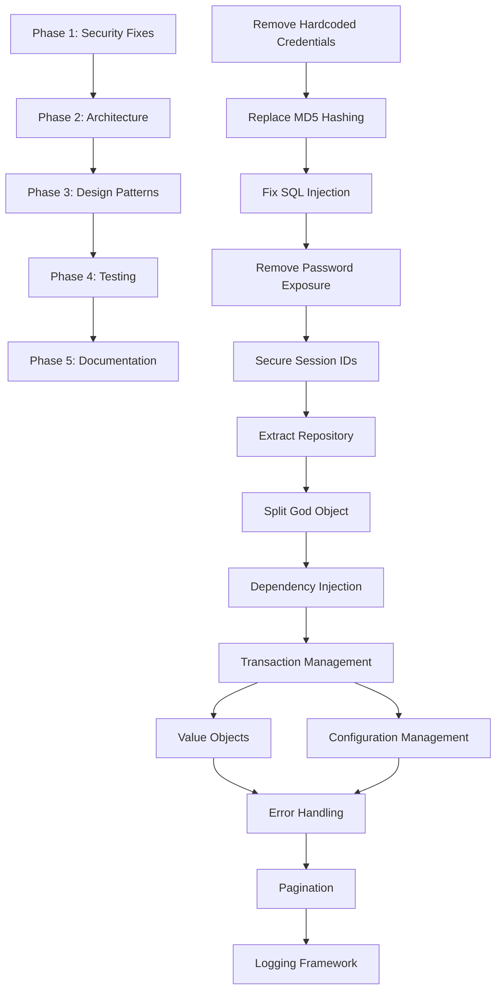

# UserManager.java Comprehensive Refactoring Plan

## Executive Summary

This document outlines a comprehensive refactoring strategy for the UserManager.java class, which currently exhibits severe architectural problems and critical security vulnerabilities. The 475-line monolithic class violates virtually every SOLID principle and requires immediate attention to prevent security breaches and enable future development.

**Current State Assessment:**
- **Security Risk Level**: CRITICAL (11 critical vulnerabilities)
- **Technical Debt**: EXTREME (47 identified issues)
- **Maintainability**: EXTREMELY LOW
- **Estimated Refactoring Effort**: 6-8 sprints (24-32 developer weeks)

## Refactoring Strategy Overview

### Primary Objectives
1. **Eliminate Critical Security Vulnerabilities** (Immediate Priority)
2. **Apply SOLID Principles** through architectural restructuring
3. **Implement Clean Architecture** with proper layer separation
4. **Ensure Comprehensive Test Coverage** (target: >80%)
5. **Enable Scalable Development** for future feature additions

### Target Architecture
- **Domain Layer**: User entities and business rules
- **Application Layer**: Use cases and application services
- **Infrastructure Layer**: Database, email, and external integrations
- **Presentation Layer**: Controllers and DTOs

---

## Phase 1: Critical Security Remediation (Sprint 1 - Immediate)

### Priority Level: CRITICAL - Must be completed immediately

### 1.1 Remove Hardcoded Credentials
**Refactoring Technique**: Replace Magic Number with Symbolic Constant + Configuration Management

**Current Issue**:
```java
private String SMTP_PASS = "hardcodedpassword123"; // Line 27
"password123" // Line 48 - Database password
```

**Solution**:
- **Step 1**: Create `ApplicationConfiguration` class
- **Step 2**: Use environment variables for sensitive data
- **Step 3**: Implement configuration validation at startup

**Implementation**:
```java
@Configuration
public class ApplicationConfiguration {
    @Value("${database.password}")
    private String databasePassword;
    
    @Value("${smtp.password}")
    private String smtpPassword;
    
    // Validation in @PostConstruct
}
```

**Risk Assessment**: LOW - Configuration changes with validation
**Estimated Effort**: 1 developer day
**Testing Strategy**: Unit tests for configuration loading, integration tests with test environment

### 1.2 Replace Weak Password Hashing (MD5 → BCrypt)
**Refactoring Technique**: Substitute Algorithm + Extract Class

**Current Issue**:
```java
MessageDigest md = MessageDigest.getInstance("MD5"); // Line 218
```

**Solution**:
- **Step 1**: Create `PasswordService` interface
- **Step 2**: Implement `BCryptPasswordService`
- **Step 3**: Create migration strategy for existing passwords

**Implementation**:
```java
public interface PasswordService {
    String hashPassword(String password);
    boolean verifyPassword(String password, String hash);
}

@Service
public class BCryptPasswordService implements PasswordService {
    private final BCryptPasswordEncoder encoder = new BCryptPasswordEncoder(12);
    
    @Override
    public String hashPassword(String password) {
        return encoder.encode(password);
    }
    
    @Override
    public boolean verifyPassword(String password, String hash) {
        // Handle both MD5 (legacy) and BCrypt during migration
        if (hash.length() == 32) { // MD5 hash
            return migrateFromMD5(password, hash);
        }
        return encoder.matches(password, hash);
    }
}
```

**Risk Assessment**: MEDIUM - Requires careful migration strategy
**Estimated Effort**: 2 developer days
**Testing Strategy**: Unit tests for both algorithms, integration tests for migration

### 1.3 Fix SQL Injection Vulnerability
**Refactoring Technique**: Replace Dynamic Query with Whitelist Validation

**Current Issue**:
```java
sql.append(entry.getKey()).append(" = ?"); // Line 405 - No field validation
```

**Solution**:
- **Step 1**: Create allowed fields whitelist
- **Step 2**: Validate all field names before query construction
- **Step 3**: Use enum for allowed update fields

**Implementation**:
```java
public enum AllowedUserFields {
    EMAIL("email"),
    ROLE("role"),
    PROFILE_DATA("profile_data");
    
    private final String fieldName;
    
    public static boolean isValidField(String field) {
        return Arrays.stream(values())
                .anyMatch(f -> f.fieldName.equals(field));
    }
}
```

**Risk Assessment**: LOW - Straightforward validation addition
**Estimated Effort**: 1 developer day
**Testing Strategy**: Unit tests for field validation, security tests for injection attempts

### 1.4 Remove Password Exposure from API Responses
**Refactoring Technique**: Extract Data Transfer Object

**Current Issue**:
```java
user.put("password", rs.getString("password")); // Lines 378, 447, 454
```

**Solution**:
- **Step 1**: Create `UserDTO` without password field
- **Step 2**: Create mapping between entity and DTO
- **Step 3**: Update all response methods

**Implementation**:
```java
public class UserDTO {
    private final Long id;
    private final String username;
    private final String email;
    private final LocalDateTime createdDate;
    private final String role;
    // NO password field
}
```

**Risk Assessment**: LOW - Simple DTO creation
**Estimated Effort**: 1 developer day
**Testing Strategy**: Unit tests for DTO mapping, integration tests for API responses

### 1.5 Implement Cryptographically Secure Session IDs
**Refactoring Technique**: Substitute Algorithm + Extract Class

**Current Issue**:
```java
"session_" + System.currentTimeMillis() + "_" + new Random().nextInt(10000) // Line 264
```

**Solution**:
- **Step 1**: Create `SessionIdGenerator` using SecureRandom
- **Step 2**: Use cryptographically secure random bytes
- **Step 3**: Implement proper entropy

**Implementation**:
```java
@Component
public class SessionIdGenerator {
    private static final SecureRandom secureRandom = new SecureRandom();
    
    public String generateSessionId() {
        byte[] randomBytes = new byte[32];
        secureRandom.nextBytes(randomBytes);
        return Base64.getUrlEncoder().withoutPadding().encodeToString(randomBytes);
    }
}
```

**Risk Assessment**: LOW - Straightforward algorithm replacement
**Estimated Effort**: 0.5 developer days
**Testing Strategy**: Unit tests for uniqueness and entropy

**Phase 1 Total Effort**: 5.5 developer days
**Phase 1 Risk**: LOW-MEDIUM (well-defined changes)

---

## Phase 2: Architectural Refactoring (Sprints 2-3)

### Priority Level: HIGH - Fundamental architectural improvements

### 2.1 Extract Repository Layer
**Refactoring Technique**: Extract Class + Hide Delegate + Move Method

**Current Issue**: Database operations scattered throughout business logic

**Solution**: Implement Repository Pattern with proper abstraction

**Target Architecture**:
```java
public interface UserRepository {
    Optional<User> findByUsername(String username);
    Optional<User> findByEmail(String email);
    User save(User user);
    void delete(Long userId);
    List<User> findAll(Pageable pageable);
    boolean existsByUsernameOrEmail(String username, String email);
}

@Repository
public class JdbcUserRepository implements UserRepository {
    private final JdbcTemplate jdbcTemplate;
    // Implementation with proper SQL handling
}
```

**Refactoring Steps**:
1. **Create User Entity Class**
2. **Extract UserRepository Interface**
3. **Implement JdbcUserRepository**
4. **Move all SQL operations from UserManager**
5. **Inject UserRepository into services**

**Risk Assessment**: MEDIUM - Large structural change
**Estimated Effort**: 5 developer days
**Testing Strategy**: Repository unit tests, integration tests with test database

### 2.2 Split God Object into Focused Services
**Refactoring Technique**: Extract Class + Single Responsibility Principle

**Current Issue**: UserManager handles 8+ distinct responsibilities

**Target Services**:

#### 2.2.1 UserService
```java
@Service
public class UserService {
    private final UserRepository userRepository;
    private final PasswordService passwordService;
    private final UserValidator userValidator;
    
    public User createUser(CreateUserRequest request) {
        userValidator.validateCreation(request);
        User user = User.builder()
            .username(request.getUsername())
            .email(request.getEmail())
            .passwordHash(passwordService.hashPassword(request.getPassword()))
            .role(request.getRole())
            .build();
        return userRepository.save(user);
    }
}
```

#### 2.2.2 AuthenticationService
```java
@Service
public class AuthenticationService {
    private final UserRepository userRepository;
    private final PasswordService passwordService;
    private final SessionService sessionService;
    private final AccountLockingService accountLockingService;
    
    public AuthenticationResult authenticate(String username, String password, String ipAddress) {
        // Focused authentication logic
    }
}
```

#### 2.2.3 EmailService
```java
@Service
public class EmailService {
    private final JavaMailSender mailSender;
    private final EmailTemplateService templateService;
    
    public void sendWelcomeEmail(User user) {
        // Focused email sending logic
    }
}
```

#### 2.2.4 AuditService
```java
@Service
public class AuditService {
    private final AuditRepository auditRepository;
    
    public void logUserAction(Long userId, AuditAction action, String ipAddress) {
        // Focused audit logging
    }
}
```

**Refactoring Steps**:
1. **Extract Method for each responsibility area**
2. **Create service interfaces**
3. **Move methods to appropriate services**
4. **Update dependencies and injection**
5. **Remove UserManager class**

**Risk Assessment**: HIGH - Major structural refactoring
**Estimated Effort**: 8 developer days
**Testing Strategy**: Service unit tests, integration tests for service interactions

### 2.3 Implement Dependency Injection
**Refactoring Technique**: Replace Constructor with Factory Method + Dependency Injection

**Current Issue**: Singleton pattern with constructor coupling

**Solution**: Spring dependency injection with proper lifecycle management

**Target Architecture**:
```java
@Configuration
public class UserManagementConfiguration {
    
    @Bean
    public UserService userService(UserRepository userRepository, 
                                  PasswordService passwordService,
                                  UserValidator userValidator) {
        return new UserService(userRepository, passwordService, userValidator);
    }
    
    // Additional bean configurations
}
```

**Risk Assessment**: MEDIUM - Framework integration required
**Estimated Effort**: 3 developer days
**Testing Strategy**: Spring context tests, integration tests

### 2.4 Add Transaction Management
**Refactoring Technique**: Introduce Cross-cutting Concern

**Current Issue**: No transaction boundaries for multi-step operations

**Solution**: Declarative transaction management

**Implementation**:
```java
@Service
@Transactional
public class UserService {
    
    @Transactional
    public User createUser(CreateUserRequest request) {
        // All operations in single transaction
        User user = createUserEntity(request);
        user = userRepository.save(user);
        auditService.logUserAction(user.getId(), AuditAction.USER_CREATED, request.getIpAddress());
        return user;
    }
}
```

**Risk Assessment**: LOW - Standard Spring feature
**Estimated Effort**: 1 developer day
**Testing Strategy**: Transaction rollback tests, integration tests

**Phase 2 Total Effort**: 17 developer days
**Phase 2 Risk**: MEDIUM-HIGH (architectural changes)

---

## Phase 3: Design Pattern Implementation (Sprints 4-5)

### Priority Level: MEDIUM-HIGH - Improve design quality and maintainability

### 3.1 Create Value Objects
**Refactoring Technique**: Replace Primitive with Object + Encapsulate Field

**Current Issue**: Primitive obsession for domain concepts

**Target Value Objects**:

#### 3.1.1 Email Value Object
```java
public class Email {
    private static final Pattern VALID_EMAIL_PATTERN = 
        Pattern.compile("^[a-zA-Z0-9_+&*-]+(?:\\.[a-zA-Z0-9_+&*-]+)*@(?:[a-zA-Z0-9-]+\\.)+[a-zA-Z]{2,7}$");
    
    private final String value;
    
    public Email(String email) {
        if (!isValid(email)) {
            throw new InvalidEmailException("Invalid email format: " + email);
        }
        this.value = email;
    }
    
    private boolean isValid(String email) {
        return email != null && VALID_EMAIL_PATTERN.matcher(email).matches();
    }
    
    public String getValue() { return value; }
    
    @Override
    public boolean equals(Object obj) { /* implementation */ }
    @Override
    public int hashCode() { /* implementation */ }
}
```

#### 3.1.2 Password Value Object
```java
public class Password {
    private static final Pattern PASSWORD_PATTERN = 
        Pattern.compile("^(?=.*[a-z])(?=.*[A-Z])(?=.*\\d)[a-zA-Z\\d@$!%*?&]{8,}$");
    
    private final String value;
    
    public Password(String password) {
        validatePassword(password);
        this.value = password;
    }
    
    private void validatePassword(String password) {
        if (password == null || !PASSWORD_PATTERN.matcher(password).matches()) {
            throw new InvalidPasswordException("Password must be at least 8 characters with upper, lower and digit");
        }
    }
}
```

#### 3.1.3 SessionToken Value Object
```java
public class SessionToken {
    private final String value;
    private final LocalDateTime expiresAt;
    
    public SessionToken(String value, LocalDateTime expiresAt) {
        this.value = Objects.requireNonNull(value);
        this.expiresAt = Objects.requireNonNull(expiresAt);
    }
    
    public boolean isExpired() {
        return LocalDateTime.now().isAfter(expiresAt);
    }
}
```

**Risk Assessment**: LOW - Value objects are safe refactoring
**Estimated Effort**: 4 developer days
**Testing Strategy**: Value object unit tests, integration tests for validation

### 3.2 Implement Configuration Management
**Refactoring Technique**: Replace Magic Number with Symbolic Constant + Configuration Pattern

**Current Issue**: Magic numbers and hardcoded values throughout code

**Solution**: Externalized configuration with type-safe properties

**Implementation**:
```java
@ConfigurationProperties(prefix = "user-management")
@Component
public class UserManagementConfiguration {
    
    @NotNull
    @Min(1)
    @Max(10)
    private Integer maxLoginAttempts = 5;
    
    @NotNull
    @PositiveOrZero
    private Duration sessionTimeout = Duration.ofHours(24);
    
    @NotNull
    @Size(min = 8)
    private String passwordRegex = "^(?=.*[a-z])(?=.*[A-Z])(?=.*\\d)[a-zA-Z\\d@$!%*?&]{8,}$";
    
    @NotNull
    @Size(min = 3, max = 20)
    private String usernameRegex = "^[a-zA-Z0-9_]+$";
    
    // Getters and setters with validation
}
```

**Configuration File** (`application.yml`):
```yaml
user-management:
  max-login-attempts: 5
  session-timeout: 24h
  password-regex: "^(?=.*[a-z])(?=.*[A-Z])(?=.*\\d)[a-zA-Z\\d@$!%*?&]{8,}$"
  username-regex: "^[a-zA-Z0-9_]+$"
```

**Risk Assessment**: LOW - Configuration externalization
**Estimated Effort**: 2 developer days
**Testing Strategy**: Configuration validation tests, property binding tests

### 3.3 Implement Proper Error Handling
**Refactoring Technique**: Replace Error Code with Exception + Extract Exception Hierarchy

**Current Issue**: Poor error handling with printStackTrace and System.exit

**Solution**: Comprehensive exception hierarchy with proper handling

**Exception Hierarchy**:
```java
public abstract class UserManagementException extends Exception {
    protected UserManagementException(String message) { super(message); }
    protected UserManagementException(String message, Throwable cause) { super(message, cause); }
}

public class UserNotFoundException extends UserManagementException {
    public UserNotFoundException(String username) {
        super("User not found: " + username);
    }
}

public class AccountLockedException extends UserManagementException {
    public AccountLockedException(String username) {
        super("Account is locked: " + username);
    }
}

public class InvalidCredentialsException extends UserManagementException {
    public InvalidCredentialsException() {
        super("Invalid username or password");
    }
}
```

**Global Exception Handler**:
```java
@ControllerAdvice
public class UserManagementExceptionHandler {
    
    @ExceptionHandler(UserNotFoundException.class)
    public ResponseEntity<ErrorResponse> handleUserNotFound(UserNotFoundException ex) {
        return ResponseEntity.status(HttpStatus.NOT_FOUND)
            .body(new ErrorResponse("USER_NOT_FOUND", ex.getMessage()));
    }
    
    @ExceptionHandler(AccountLockedException.class)
    public ResponseEntity<ErrorResponse> handleAccountLocked(AccountLockedException ex) {
        return ResponseEntity.status(HttpStatus.FORBIDDEN)
            .body(new ErrorResponse("ACCOUNT_LOCKED", ex.getMessage()));
    }
}
```

**Risk Assessment**: LOW - Standard exception handling patterns
**Estimated Effort**: 3 developer days
**Testing Strategy**: Exception handling tests, error response tests

### 3.4 Add Pagination Support
**Refactoring Technique**: Introduce Parameter Object + Extract Method

**Current Issue**: getAllUsers() returns all users without pagination

**Solution**: Implement pagination with configurable page sizes

**Implementation**:
```java
public class PageRequest {
    private final int page;
    private final int size;
    private final String sortBy;
    private final SortDirection sortDirection;
    
    public PageRequest(int page, int size, String sortBy, SortDirection sortDirection) {
        this.page = Math.max(0, page);
        this.size = Math.min(Math.max(1, size), 100); // Max 100 per page
        this.sortBy = sortBy != null ? sortBy : "id";
        this.sortDirection = sortDirection != null ? sortDirection : SortDirection.ASC;
    }
}

public class PageResult<T> {
    private final List<T> content;
    private final int currentPage;
    private final int totalPages;
    private final long totalElements;
    private final boolean hasNext;
    private final boolean hasPrevious;
}

@Service
public class UserService {
    public PageResult<UserDTO> getUsers(PageRequest pageRequest) {
        // Implementation with proper pagination
    }
}
```

**Risk Assessment**: LOW - Standard pagination pattern
**Estimated Effort**: 2 developer days
**Testing Strategy**: Pagination unit tests, performance tests with large datasets

### 3.5 Implement Logging Framework
**Refactoring Technique**: Replace Debug Print with Logging Framework

**Current Issue**: printStackTrace() calls throughout code

**Solution**: Structured logging with SLF4J and Logback

**Implementation**:
```java
@Service
public class UserService {
    private static final Logger logger = LoggerFactory.getLogger(UserService.class);
    
    public User createUser(CreateUserRequest request) {
        logger.info("Creating new user with username: {}", request.getUsername());
        try {
            User user = processUserCreation(request);
            logger.info("Successfully created user with ID: {}", user.getId());
            return user;
        } catch (Exception e) {
            logger.error("Failed to create user with username: {}", request.getUsername(), e);
            throw new UserCreationException("Failed to create user", e);
        }
    }
}
```

**Logging Configuration** (`logback-spring.xml`):
```xml
<configuration>
    <appender name="STDOUT" class="ch.qos.logback.core.ConsoleAppender">
        <encoder>
            <pattern>%d{HH:mm:ss.SSS} [%thread] %-5level %logger{36} - %msg%n</pattern>
        </encoder>
    </appender>
    
    <appender name="FILE" class="ch.qos.logback.core.rolling.RollingFileAppender">
        <file>logs/user-management.log</file>
        <rollingPolicy class="ch.qos.logback.core.rolling.TimeBasedRollingPolicy">
            <fileNamePattern>logs/user-management.%d{yyyy-MM-dd}.log</fileNamePattern>
            <maxHistory>30</maxHistory>
        </rollingPolicy>
    </appender>
    
    <logger name="com.example.usermanagement" level="INFO"/>
    <root level="WARN">
        <appender-ref ref="STDOUT"/>
        <appender-ref ref="FILE"/>
    </root>
</configuration>
```

**Risk Assessment**: LOW - Standard logging implementation
**Estimated Effort**: 1 developer day
**Testing Strategy**: Log output verification, performance tests

**Phase 3 Total Effort**: 12 developer days
**Phase 3 Risk**: LOW-MEDIUM (incremental improvements)

---

## Phase 4: Testing and Quality Assurance (Sprints 6-7)

### Priority Level: HIGH - Ensure refactoring success and prevent regressions

### 4.1 Comprehensive Unit Testing
**Testing Strategy**: Achieve >80% code coverage with meaningful tests

**Test Structure**:
```java
@ExtendWith(MockitoExtension.class)
class UserServiceTest {
    
    @Mock
    private UserRepository userRepository;
    
    @Mock
    private PasswordService passwordService;
    
    @Mock
    private UserValidator userValidator;
    
    @InjectMocks
    private UserService userService;
    
    @Test
    void createUser_ValidRequest_ReturnsCreatedUser() {
        // Given
        CreateUserRequest request = CreateUserRequest.builder()
            .username("testuser")
            .email("test@example.com")
            .password("SecurePass123")
            .role("USER")
            .build();
        
        User expectedUser = User.builder()
            .id(1L)
            .username("testuser")
            .email("test@example.com")
            .build();
        
        when(userValidator.validateCreation(request)).thenReturn(ValidationResult.valid());
        when(passwordService.hashPassword("SecurePass123")).thenReturn("$2a$12$hashedpassword");
        when(userRepository.save(any(User.class))).thenReturn(expectedUser);
        
        // When
        User actualUser = userService.createUser(request);
        
        // Then
        assertThat(actualUser).isEqualTo(expectedUser);
        verify(userValidator).validateCreation(request);
        verify(passwordService).hashPassword("SecurePass123");
        verify(userRepository).save(any(User.class));
    }
    
    @Test
    void createUser_InvalidRequest_ThrowsValidationException() {
        // Given
        CreateUserRequest request = CreateUserRequest.builder()
            .username("ab") // Too short
            .build();
        
        when(userValidator.validateCreation(request))
            .thenThrow(new ValidationException("Username must be 3-20 characters"));
        
        // When & Then
        assertThatThrownBy(() -> userService.createUser(request))
            .isInstanceOf(ValidationException.class)
            .hasMessage("Username must be 3-20 characters");
    }
}
```

**Repository Testing**:
```java
@DataJdbcTest
class JdbcUserRepositoryTest {
    
    @Autowired
    private TestEntityManager entityManager;
    
    @Autowired
    private UserRepository userRepository;
    
    @Test
    void findByUsername_ExistingUser_ReturnsUser() {
        // Given
        User user = entityManager.persistAndFlush(User.builder()
            .username("testuser")
            .email("test@example.com")
            .passwordHash("hashedpassword")
            .build());
        
        // When
        Optional<User> found = userRepository.findByUsername("testuser");
        
        // Then
        assertThat(found).isPresent();
        assertThat(found.get().getUsername()).isEqualTo("testuser");
    }
}
```

**Estimated Effort**: 8 developer days
**Target Coverage**: >80% line coverage, >90% branch coverage

### 4.2 Integration Testing
**Testing Strategy**: Test service interactions and database operations

**Integration Test Structure**:
```java
@SpringBootTest
@TestPropertySource(locations = "classpath:application-integration-test.properties")
class UserManagementIntegrationTest {
    
    @Autowired
    private UserService userService;
    
    @Autowired
    private AuthenticationService authenticationService;
    
    @Autowired
    private TestContainers testDatabase;
    
    @Test
    @Transactional
    void userLifecycle_CreateAndAuthenticate_Success() {
        // Given
        CreateUserRequest createRequest = CreateUserRequest.builder()
            .username("integrationtest")
            .email("integration@test.com")
            .password("SecurePass123")
            .role("USER")
            .build();
        
        // When - Create user
        User createdUser = userService.createUser(createRequest);
        
        // Then - User is created
        assertThat(createdUser.getId()).isNotNull();
        assertThat(createdUser.getUsername()).isEqualTo("integrationtest");
        
        // When - Authenticate user
        AuthenticationRequest authRequest = AuthenticationRequest.builder()
            .username("integrationtest")
            .password("SecurePass123")
            .ipAddress("192.168.1.1")
            .build();
        
        AuthenticationResult authResult = authenticationService.authenticate(authRequest);
        
        // Then - Authentication succeeds
        assertThat(authResult.isSuccess()).isTrue();
        assertThat(authResult.getSessionToken()).isNotNull();
    }
}
```

**Estimated Effort**: 4 developer days

### 4.3 Security Testing
**Testing Strategy**: Verify security improvements and test attack scenarios

**Security Test Examples**:
```java
@SpringBootTest
class SecurityTest {
    
    @Test
    void updateUser_UnauthorizedField_RejectsUpdate() {
        // Test SQL injection prevention
        Map<String, Object> maliciousUpdate = Map.of(
            "password; DROP TABLE users; --", "value"
        );
        
        assertThatThrownBy(() -> userService.updateUser(1L, maliciousUpdate))
            .isInstanceOf(ValidationException.class)
            .hasMessageContaining("Invalid field name");
    }
    
    @Test
    void getAllUsers_Response_DoesNotContainPasswords() {
        // Verify password exposure is prevented
        PageResult<UserDTO> users = userService.getUsers(new PageRequest(0, 10));
        
        users.getContent().forEach(user -> {
            // Verify DTO doesn't have password field through reflection
            Field[] fields = user.getClass().getDeclaredFields();
            assertThat(Arrays.stream(fields).map(Field::getName))
                .doesNotContain("password", "passwordHash");
        });
    }
}
```

**Estimated Effort**: 3 developer days

### 4.4 Performance Testing
**Testing Strategy**: Ensure refactoring doesn't impact performance negatively

**Performance Test Examples**:
```java
@SpringBootTest
class PerformanceTest {
    
    @Test
    @Timeout(value = 5, unit = TimeUnit.SECONDS)
    void createUser_Performance_CompletesWithinTimeout() {
        CreateUserRequest request = CreateUserRequest.builder()
            .username("perftest")
            .email("perf@test.com")
            .password("SecurePass123")
            .build();
        
        User user = userService.createUser(request);
        assertThat(user).isNotNull();
    }
    
    @Test
    void getUsers_LargeDataset_PaginationWorks() {
        // Create 1000 test users
        for (int i = 0; i < 1000; i++) {
            createTestUser("user" + i, "user" + i + "@test.com");
        }
        
        // Test pagination performance
        Instant start = Instant.now();
        PageResult<UserDTO> page = userService.getUsers(new PageRequest(0, 50));
        Duration elapsed = Duration.between(start, Instant.now());
        
        assertThat(page.getContent()).hasSize(50);
        assertThat(elapsed).isLessThan(Duration.ofSeconds(1));
    }
}
```

**Estimated Effort**: 2 developer days

**Phase 4 Total Effort**: 17 developer days
**Phase 4 Risk**: LOW (testing activities)

---

## Phase 5: Documentation and Monitoring (Sprint 8)

### Priority Level: MEDIUM - Support long-term maintenance

### 5.1 API Documentation
**Documentation Strategy**: Generate comprehensive API documentation

**Implementation**: OpenAPI 3.0 with Spring Doc

```java
@RestController
@Tag(name = "User Management", description = "APIs for user creation, authentication, and management")
public class UserController {
    
    @PostMapping("/users")
    @Operation(summary = "Create new user", 
               description = "Creates a new user account with the provided information")
    @ApiResponses(value = {
        @ApiResponse(responseCode = "201", description = "User created successfully",
                    content = @Content(schema = @Schema(implementation = UserDTO.class))),
        @ApiResponse(responseCode = "400", description = "Invalid input data",
                    content = @Content(schema = @Schema(implementation = ErrorResponse.class))),
        @ApiResponse(responseCode = "409", description = "User already exists",
                    content = @Content(schema = @Schema(implementation = ErrorResponse.class)))
    })
    public ResponseEntity<UserDTO> createUser(
        @Valid @RequestBody CreateUserRequest request) {
        // Implementation
    }
}
```

**Estimated Effort**: 1 developer day

### 5.2 Architectural Decision Records (ADRs)
**Documentation Strategy**: Document key architectural decisions made during refactoring

**ADR Example**:
```markdown
# ADR-001: Replace MD5 Password Hashing with BCrypt

## Status
Accepted

## Context
The existing UserManager class uses MD5 for password hashing, which is cryptographically broken and vulnerable to rainbow table attacks.

## Decision
Replace MD5 with BCrypt using a work factor of 12, which provides adequate security while maintaining reasonable performance.

## Consequences
### Positive
- Significantly improved password security
- Resistance to rainbow table attacks
- Adaptive cost factor allows future security adjustments

### Negative
- Requires migration strategy for existing passwords
- Slightly increased CPU usage for password operations
- Temporary complexity during migration period

## Implementation
- Created PasswordService interface with BCryptPasswordService implementation
- Added migration logic to handle both MD5 and BCrypt hashes during transition
- Configured work factor to 12 for optimal security/performance balance
```

**Estimated Effort**: 2 developer days

### 5.3 Monitoring and Metrics
**Monitoring Strategy**: Implement comprehensive application monitoring

**Metrics Implementation**:
```java
@Service
public class UserService {
    private static final Counter userCreationCounter = Counter.builder("user.creation.total")
        .description("Total number of user creation attempts")
        .register(Metrics.globalRegistry);
    
    private static final Timer userCreationTimer = Timer.builder("user.creation.duration")
        .description("Time taken to create user")
        .register(Metrics.globalRegistry);
    
    public User createUser(CreateUserRequest request) {
        return Timer.Sample.start(Metrics.globalRegistry)
            .stop(userCreationTimer)
            .recordCallable(() -> {
                try {
                    User user = processUserCreation(request);
                    userCreationCounter.increment("status", "success");
                    return user;
                } catch (Exception e) {
                    userCreationCounter.increment("status", "failure");
                    throw e;
                }
            });
    }
}
```

**Health Checks**:
```java
@Component
public class DatabaseHealthIndicator implements HealthIndicator {
    
    @Override
    public Health health() {
        try {
            userRepository.count(); // Simple database connectivity check
            return Health.up().withDetail("database", "Available").build();
        } catch (Exception e) {
            return Health.down(e).withDetail("database", "Unavailable").build();
        }
    }
}
```

**Estimated Effort**: 2 developer days

**Phase 5 Total Effort**: 5 developer days
**Phase 5 Risk**: LOW (documentation and monitoring)

---

## Implementation Sequence and Dependencies

### Critical Path Dependencies



### Parallel Work Opportunities

1. **Phase 1**: Security fixes can be done in parallel after configuration setup
2. **Phase 3**: Value objects can be developed alongside configuration management
3. **Phase 4**: Different types of tests can be written in parallel
4. **Phase 5**: Documentation can start during Phase 4

### Risk Mitigation Strategies

#### High-Risk Activities
1. **God Object Splitting (Phase 2.2)**
   - **Mitigation**: Extract methods first, then move to services gradually
   - **Rollback Plan**: Keep original class as deprecated backup until all tests pass

2. **Repository Extraction (Phase 2.1)**
   - **Mitigation**: Implement repository alongside existing code, switch incrementally
   - **Rollback Plan**: Toggle between old and new implementations via feature flag

3. **Password Migration (Phase 1.2)**
   - **Mitigation**: Support both algorithms during transition period
   - **Rollback Plan**: Maintain backward compatibility until all passwords migrated

#### Medium-Risk Activities
1. **Dependency Injection (Phase 2.3)**
   - **Mitigation**: Introduce Spring gradually, maintain singleton fallback
   - **Testing**: Extensive integration testing of bean wiring

2. **Transaction Management (Phase 2.4)**
   - **Mitigation**: Add transactions declaratively, test rollback scenarios
   - **Testing**: Transaction boundary testing with intentional failures

### Quality Gates

#### Phase Completion Criteria

**Phase 1 Complete When**:
- All hardcoded credentials externalized
- MD5 replaced with BCrypt (migration strategy in place)
- SQL injection vulnerability patched
- No passwords in API responses
- Cryptographically secure session IDs implemented
- Security scan shows no critical vulnerabilities

**Phase 2 Complete When**:
- Repository layer abstraction implemented
- UserManager split into focused services
- Spring dependency injection working
- Transaction management operational
- All database operations use repository pattern

**Phase 3 Complete When**:
- Value objects implemented and validated
- Configuration externalized and validated
- Exception hierarchy operational
- Pagination working with performance tests
- Structured logging operational

**Phase 4 Complete When**:
- Unit test coverage >80%
- Integration tests cover main scenarios
- Security tests verify vulnerability fixes
- Performance benchmarks meet requirements
- All tests automated in CI/CD pipeline

**Phase 5 Complete When**:
- API documentation published
- ADRs document key decisions
- Monitoring dashboards operational
- Health checks functional
- Runbooks available for operations

### Success Metrics

#### Quantitative Metrics
- **Code Quality**: Cyclomatic complexity <10 per method
- **Security**: Zero critical/high vulnerabilities in security scans
- **Performance**: Response times <500ms for 95th percentile
- **Test Coverage**: >80% line coverage, >90% branch coverage
- **Size Reduction**: No single class >150 lines
- **Dependencies**: Each service depends on <5 other services

#### Qualitative Metrics
- **Maintainability**: New features can be added without modifying existing services
- **Testability**: New code can achieve >90% test coverage easily
- **Readability**: New team members can understand code within 1 week
- **Reliability**: Zero production incidents related to user management
- **Security**: Passes penetration testing without findings

## Resource Requirements and Timeline

### Team Composition
- **2 Senior Developers**: Lead refactoring efforts, architectural decisions
- **2 Mid-level Developers**: Implementation work, testing
- **1 Security Specialist**: Security review, vulnerability testing
- **1 DevOps Engineer**: CI/CD pipeline, monitoring setup

### Sprint Breakdown

| Phase | Sprint | Duration | Effort (Dev Days) | Key Deliverables |
|-------|--------|----------|------------------|------------------|
| 1 | 1 | 2 weeks | 5.5 | Security vulnerabilities fixed |
| 2 | 2-3 | 4 weeks | 17 | Repository pattern, service extraction |
| 3 | 4-5 | 4 weeks | 12 | Value objects, configuration, error handling |
| 4 | 6-7 | 4 weeks | 17 | Comprehensive testing suite |
| 5 | 8 | 2 weeks | 5 | Documentation and monitoring |

**Total Timeline**: 8 sprints (16 weeks)  
**Total Effort**: 56.5 developer days  
**Recommended Team Size**: 4-6 developers  
**Estimated Calendar Time**: 4 months with dedicated team

### Budget Considerations

#### Development Costs
- **Senior Developer**: $150/day × 2 developers × 80 days = $24,000
- **Mid-level Developer**: $100/day × 2 developers × 80 days = $16,000
- **Security Specialist**: $200/day × 1 specialist × 20 days = $4,000
- **DevOps Engineer**: $130/day × 1 engineer × 15 days = $1,950

**Total Development Cost**: ~$45,950

#### Additional Costs
- **Tools and Infrastructure**: $2,000
- **Training and Documentation**: $1,000
- **Security Audits**: $3,000
- **Contingency (15%)**: $7,693

**Total Project Cost**: ~$59,643

### Risk Factors

#### Technical Risks
1. **Legacy Database Schema**: May require schema migrations
   - **Mitigation**: Design repository to accommodate existing schema
   - **Impact**: Medium - May add 1-2 days to repository implementation

2. **Existing Integrations**: Other systems may depend on current UserManager API
   - **Mitigation**: Maintain backward compatibility facade
   - **Impact**: High - May require additional interface maintenance

3. **Production Data Migration**: Existing user passwords need migration
   - **Mitigation**: Gradual migration strategy with dual algorithm support
   - **Impact**: Medium - Adds complexity to authentication service

#### Business Risks
1. **Feature Development Freeze**: New features blocked during refactoring
   - **Mitigation**: Parallel development on non-user-management features
   - **Impact**: High - May affect product roadmap

2. **Performance Regression**: Refactored code may be slower
   - **Mitigation**: Comprehensive performance testing, benchmarking
   - **Impact**: Medium - May require optimization work

3. **Security Vulnerabilities During Transition**: Temporary exposure during migration
   - **Mitigation**: Phase 1 addresses critical vulnerabilities immediately
   - **Impact**: Critical - Prioritize security fixes

## Conclusion

This comprehensive refactoring plan addresses the critical issues identified in the UserManager.java class through a systematic, phased approach. The plan prioritizes security vulnerabilities for immediate resolution, followed by architectural improvements that will enable long-term maintainability and scalability.

### Key Benefits Expected

1. **Security**: Elimination of all critical vulnerabilities, implementation of security best practices
2. **Maintainability**: Reduced complexity through SOLID principle application
3. **Testability**: Comprehensive test coverage enabling confident future changes
4. **Scalability**: Proper architecture supporting enterprise-scale requirements
5. **Developer Productivity**: Clear separation of concerns enabling parallel development

### Success Factors

1. **Executive Support**: Commitment to timeline and resource allocation
2. **Team Dedication**: Focused team without competing priorities
3. **Comprehensive Testing**: No phase advances without proper test coverage
4. **Gradual Migration**: Incremental changes with fallback strategies
5. **Security Focus**: Security improvements prioritized throughout

### Post-Refactoring Maintenance

1. **Code Reviews**: Mandatory reviews to maintain architectural integrity
2. **Static Analysis**: Continuous monitoring for code smells and security issues
3. **Regular Security Audits**: Quarterly security assessments
4. **Performance Monitoring**: Continuous performance tracking and alerting
5. **Documentation Updates**: Keep architectural decisions and documentation current

The successful completion of this refactoring plan will transform the UserManager class from a critical liability into a maintainable, secure, and scalable foundation for user management functionality.